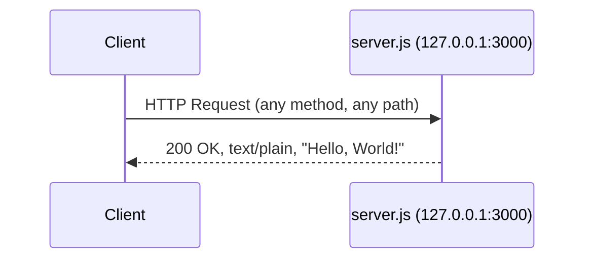
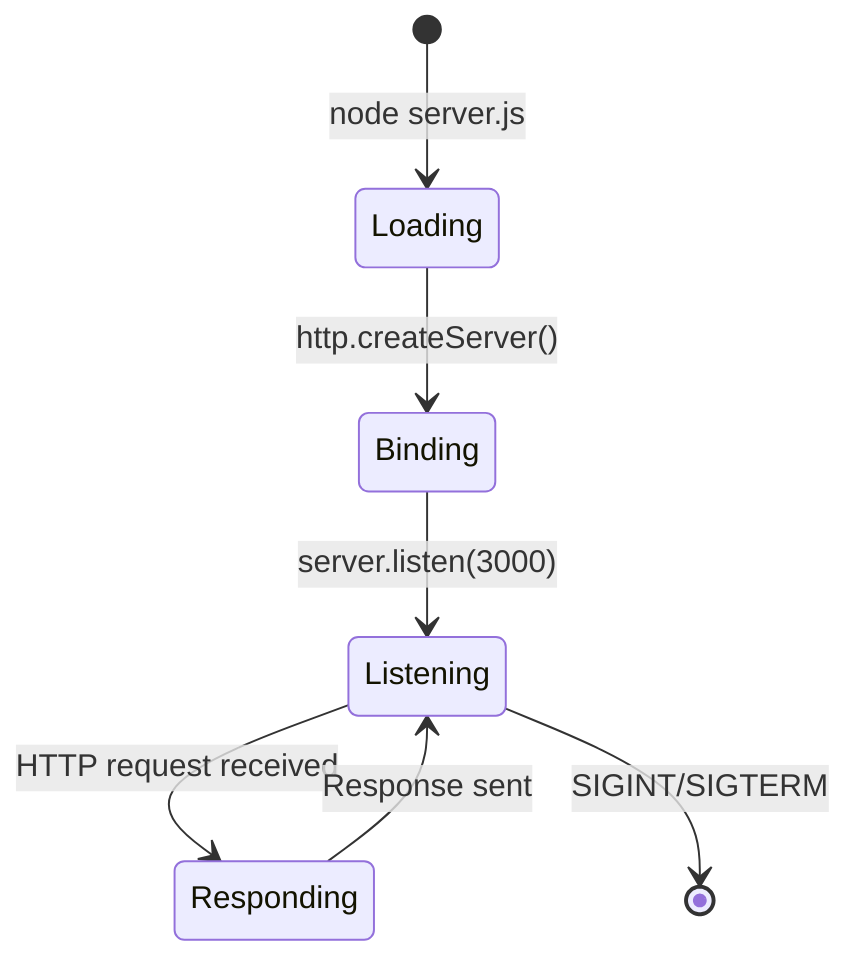

# hao-backprop-test


A minimal Node.js HTTP server that responds with "Hello, World!" to all incoming requests. This repository serves as an integration test fixture for the backprop system.

Built using the Node.js built-in [`http`](https://nodejs.org/api/http.html) module with **zero external runtime dependencies**.

---

## Table of Contents

- [Prerequisites](#prerequisites)
- [Installation](#installation)
- [Usage](#usage)
  - [Starting the Server](#starting-the-server)
  - [Making Requests](#making-requests)
- [API Documentation](#api-documentation)
  - [Endpoint Overview](#endpoint-overview)
  - [Request Format](#request-format)
  - [Response Format](#response-format)
- [Deployment Guide](#deployment-guide)
  - [Local Development](#local-development)
  - [Production Considerations](#production-considerations)
  - [Process Management](#process-management)
- [Project Structure](#project-structure)
- [Diagrams](#diagrams)
  - [Request/Response Flow](#requestresponse-flow)
  - [Server Lifecycle](#server-lifecycle)
- [Troubleshooting](#troubleshooting)
- [Contributing](#contributing)
- [License](#license)

---

## Prerequisites

Before running the server, ensure the following software is installed on your system:

| Prerequisite | Minimum Version | Recommended Version | Purpose |
|--------------|-----------------|---------------------|---------|
| [Node.js](https://nodejs.org/) | v6.0.0+ | v20.x (current runtime: v20.19.5) | JavaScript runtime to execute `server.js` |
| [npm](https://www.npmjs.com/) | v7.0.0+ | v10.x (current: 10.8.2) | Package manager; v7+ required for `lockfileVersion` 3 support |

Verify your installation:

```bash
node --version
# Expected output: v20.19.5 (or any version >= v6.0.0)

npm --version
# Expected output: 10.8.2 (or any version >= v7.0.0)
```

---

## Installation

1. **Clone the repository:**

```bash
git clone <repository-url>
cd hao-backprop-test
```

2. **Install dependencies:**

```bash
npm install
```

> **Note:** This project has **zero runtime dependencies**. Running `npm install` sets up the `package-lock.json` and installs development dependencies only (e.g., JSDoc for documentation generation).

---

## Usage

### Starting the Server

Launch the HTTP server by running:

```bash
node server.js
```

You should see the following console output confirming the server is running:

```text
Server running at http://127.0.0.1:3000/
```

The server is now listening for incoming HTTP connections on `127.0.0.1:3000` (see `server.js` lines 29 and 38 for the hostname and port configuration, lines 78–80 for the listen call).

### Making Requests

Once the server is running, send an HTTP request using `curl` or any HTTP client:

**GET request:**

```bash
curl http://127.0.0.1:3000/
```

**Expected output:**

```text
Hello, World!
```

**POST request (demonstrating method-agnostic behavior):**

```bash
curl -X POST http://127.0.0.1:3000/
```

**Expected output:**

```text
Hello, World!
```

The server responds identically to **all HTTP methods** (GET, POST, PUT, DELETE, PATCH, etc.) and **all URL paths**. The request handler at `server.js` lines 58–65 does not inspect the request method or URL — it always returns the same response.

---

## API Documentation

### Endpoint Overview

The server exposes a single endpoint that handles all incoming HTTP requests:

| Property | Value |
|----------|-------|
| **URL** | `http://127.0.0.1:3000/` (and any path, e.g., `/foo`, `/bar/baz`) |
| **Methods** | ALL — GET, POST, PUT, DELETE, PATCH, HEAD, OPTIONS, etc. |
| **Content-Type** | `text/plain` |
| **Status Code** | `200 OK` |
| **Response Body** | `Hello, World!\n` |

The server responds identically regardless of the HTTP method, URL path, query parameters, request headers, or request body. This behavior is defined in the request handler callback at `server.js` lines 58–65.

### Request Format

No specific request format is required. The server does not inspect or validate:

- HTTP method
- URL path or query parameters
- Request headers (e.g., `Content-Type`, `Authorization`)
- Request body

Every request receives the same fixed response.

### Response Format

| Field | Value | Source |
|-------|-------|--------|
| Status Code | `200 OK` | `server.js` line 60: `res.statusCode = 200` |
| Content-Type | `text/plain` | `server.js` line 62: `res.setHeader('Content-Type', 'text/plain')` |
| Body | `Hello, World!\n` | `server.js` line 64: `res.end('Hello, World!\n')` |

**Verbose `curl` example showing full HTTP headers:**

```bash
curl -v http://127.0.0.1:3000/
```

**Expected output (headers and body):**

```text
*   Trying 127.0.0.1:3000...
> GET / HTTP/1.1
> Host: 127.0.0.1:3000
> User-Agent: curl/8.x
> Accept: */*
>
< HTTP/1.1 200 OK
< Content-Type: text/plain
< Date: <current date>
< Connection: keep-alive
< Keep-Alive: timeout=5
< Content-Length: 14
<
Hello, World!
```

---

## Deployment Guide

### Local Development

For local development, simply run:

```bash
node server.js
```

The server binds to `127.0.0.1:3000` (loopback address only). This means:

- The server is accessible **only from the local machine** at `http://127.0.0.1:3000/`
- It is **not accessible** from other machines on the network
- This is the intended behavior for local development and testing

The hostname and port are defined as constants in `server.js` lines 29 and 38:

```javascript
const hostname = '127.0.0.1';
const port = 3000;
```

### Production Considerations

For production deployment, consider the following modifications:

- **Network binding:** Change hostname from `'127.0.0.1'` to `'0.0.0.0'` in `server.js` line 29 to accept connections from all network interfaces
- **Port configuration:** Consider using environment variables for the port (e.g., `process.env.PORT || 3000`) instead of the hardcoded value in `server.js` line 38
- **Error handling:** Add try-catch blocks and error event listeners for robustness
- **HTTPS:** Use the `https` module or a reverse proxy (e.g., Nginx) for encrypted connections
- **Logging:** Implement structured logging instead of `console.log`
- **Health checks:** Add a dedicated health-check endpoint for load balancers

### Process Management

For keeping the server running in production, use a process manager:

**Using [pm2](https://pm2.keymetrics.io/):**

```bash
# Install pm2 globally
npm install -g pm2

# Start the server with pm2
pm2 start server.js --name hello-world

# View running processes
pm2 list

# View logs
pm2 logs hello-world

# Stop the server
pm2 stop hello-world
```

**Using [forever](https://github.com/foreversd/forever):**

```bash
npm install -g forever
forever start server.js
```

**Using systemd (Linux):**

Create a service file at `/etc/systemd/system/hello-world.service` and configure it to run `node server.js` with appropriate user permissions and restart policies.

---

## Project Structure

This repository contains 21 files in a flat directory structure (no subdirectories). The files are organized into four categories: Runtime, Configuration, Documentation, and Fixture.

| File | Category | Description |
|------|----------|-------------|
| `server.js` | Runtime | HTTP server — main executable, binds to 127.0.0.1:3000 and responds with "Hello, World!" to all requests |
| `server - Copy.js` | Fixture | Original version of `server.js` (pre-documentation); integration test fixture |
| `package.json` | Configuration | npm package metadata (name: `hello_world`, version: `1.0.0`, author: `hxu`, license: MIT) |
| `package-lock.json` | Configuration | npm dependency lockfile (lockfileVersion 3) |
| `jsdoc.json` | Configuration | JSDoc documentation generator configuration — specifies source files, plugins, and output settings |
| `README.md` | Documentation | Project documentation (this file) |
| `LoginTest.java` | Fixture | Non-compilable Java stub (`com.blitzyTest` package); integration test fixture |
| `LoginTest - Copy.java` | Fixture | Duplicate Java stub; integration test fixture |
| `industry.csv` | Fixture | CSV with 43 industry labels (header: "Industry"); static reference data |
| `industry - Copy.csv` | Fixture | Duplicate CSV; static reference data fixture |
| `100Pages.pdf` | Fixture | PDF document fixture (100 pages); integration test artifact |
| `100Pages - Copy.pdf` | Fixture | Duplicate PDF document; integration test artifact |
| `demo.jpg` | Fixture | JPEG image fixture; integration test artifact |
| `demo - Copy.jpg` | Fixture | Duplicate JPEG image; integration test artifact |
| `sample.doc` | Fixture | Word document fixture; integration test artifact |
| `sample - Copy.doc` | Fixture | Duplicate Word document; integration test artifact |
| `.blitzyignore.txt` | Fixture | Empty ignore-rule placeholder (0 bytes) |
| `test.blitzyignore.txt` | Fixture | Empty ignore-rule test file (0 bytes) |
| `test1.blitzyignore.txt` | Fixture | Empty ignore-rule test file (0 bytes) |
| `test.py.txt` | Fixture | Empty placeholder file (0 bytes) |
| `test.py - Copy.txt` | Fixture | Empty duplicate placeholder file (0 bytes) |

> **Note:** Files categorized as **Fixture** are static test artifacts used by the backprop integration testing system. They are not executed or modified during normal server operation.

---

## Diagrams

### Request/Response Flow

The following sequence diagram illustrates the HTTP request/response interaction between a client and the server:



### Server Lifecycle

The following state diagram illustrates the server startup and request-handling lifecycle:



---

## Troubleshooting

### `EADDRINUSE` Error

**Error message:**

```text
Error: listen EADDRINUSE: address already in use 127.0.0.1:3000
```

**Cause:** Port 3000 is already in use by another process.

**Solution:** Stop the process using port 3000 or change the port in `server.js` line 38:

```bash
# Find the process using port 3000
lsof -i :3000    # macOS/Linux
netstat -ano | findstr :3000    # Windows

# Kill the process (replace <PID> with the actual process ID)
kill <PID>    # macOS/Linux
taskkill /PID <PID> /F    # Windows
```

### Node.js Version Issues

**Error message:**

```text
SyntaxError: Unexpected token =>
```

**Cause:** Node.js version is too old to support ES6 arrow functions (requires v6+).

**Solution:** Ensure Node.js v6+ is installed. Check with:

```bash
node --version
```

If the version is below v6, [download and install](https://nodejs.org/) a newer version.

### Connection Refused

**Error message:**

```text
curl: (7) Failed to connect to 127.0.0.1 port 3000: Connection refused
```

**Cause:** The server is not running, or it failed to start.

**Solution:**

1. Ensure the server is running: `node server.js`
2. Verify the console shows: `Server running at http://127.0.0.1:3000/`
3. Note that the server binds to `127.0.0.1` (loopback). It is **not accessible from other machines** on the network. If you need external access, change hostname to `'0.0.0.0'` in `server.js` line 29.

---

## Contributing

This repository is an **integration test fixture** for the backprop system. It is designed to remain stable and predictable for automated testing.

If you need to make changes:

1. Ensure all fixture files remain intact and unmodified
2. Verify the server still responds with `Hello, World!\n` on `127.0.0.1:3000` after any changes
3. Run `npm run doc` to regenerate JSDoc documentation if `server.js` annotations are modified
4. Update this README if any server behavior or project structure changes

---

## License

This project is licensed under the **MIT License** as declared in `package.json`.

```text
License: MIT
Author: hxu
Package: hello_world@1.0.0
```

See the `license` field in [`package.json`](package.json) for the license declaration.
