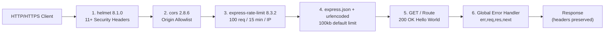
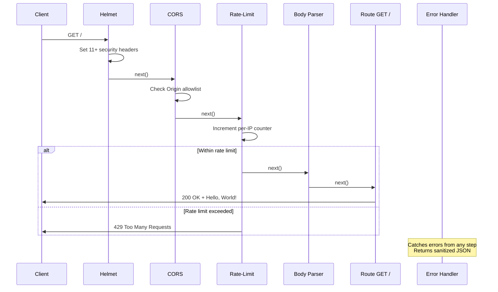

# hao-backprop-test

A hardened Node.js/Express backend application (npm package `hello_world`, version 1.0.0) that has been migrated from a bare `http.createServer()` server to Express 4.22.1 with comprehensive OWASP-aligned security middleware. The application preserves a single backward-compatible endpoint — `GET /` returning `Hello, World!\n` — while adding helmet (HTTP security headers), CORS (origin allowlisting), express-rate-limit (per-IP throttling), express-validator (input sanitization), and an optional HTTPS/TLS listener. The server binds exclusively to the loopback interface (`127.0.0.1`) and is suitable for development directly or for production deployment behind an upstream reverse proxy or WAF.

## Table of Contents

- [Overview](#overview)
- [Setup Instructions](#setup-instructions)
- [API Documentation](#api-documentation)
- [Deployment Guide](#deployment-guide)
- [Inline Code Explanations](#inline-code-explanations)
- [Troubleshooting](#troubleshooting)
- [Contributing](#contributing)
- [License](#license)

## Overview

### Project Status

| Metric                | Value             | Source                                                     |
| --------------------- | ----------------- | ---------------------------------------------------------- |
| Completion            | 80% (48/60 hours) | `blitzy/documentation/Project Guide.md` §1.2 line 24       |
| Test Suites           | 4 passing         | `blitzy/documentation/Project Guide.md` §9 line 331        |
| Tests                 | 30 passing        | `blitzy/documentation/Project Guide.md` §9 line 332        |
| npm Audit Findings    | 2 moderate (transitive — see [Known Vulnerability Disclosure](#known-vulnerability-disclosure)) | `blitzy/documentation/Project Guide.md` §9 line 320 (baseline `0`); current state divergence is environmental |
| Backward Compatibility| Preserved         | `server.js:99-129`                                         |

### Known Vulnerability Disclosure

`npm audit --audit-level=moderate` currently reports **2 moderate-severity findings** in transitive dependency `ip-address` (versions `<=10.1.0`), reachable through direct dependency `express-rate-limit` `>=8.0.1`. The advisory is [GHSA-v2v4-37r5-5v8g](https://github.com/advisories/GHSA-v2v4-37r5-5v8g) (CWE-79: XSS in Address6 HTML-emitting methods).

The baseline state documented in `blitzy/documentation/Project Guide.md` §9 line 320 was `found 0 vulnerabilities`. The npm advisory database was subsequently updated to flag the `ip-address` dependency, producing the present divergence. The vulnerability was **not introduced by any application code change** — `package.json` and `package-lock.json` are unchanged from the baseline at which the Project Guide was authored.

| Field                  | Value                                                                                          |
| ---------------------- | ---------------------------------------------------------------------------------------------- |
| Advisory ID            | GHSA-v2v4-37r5-5v8g                                                                            |
| CWE                    | CWE-79 (Cross-site Scripting)                                                                  |
| Vulnerable Package     | `ip-address` (transitive)                                                                      |
| Affected Range         | `<=10.1.0`                                                                                     |
| Reachable Via          | `express-rate-limit` `>=8.0.1` (direct dependency, currently pinned at `8.3.2`)                |
| Severity               | Moderate                                                                                       |
| Reachability           | The vulnerable HTML-emitting methods of the `Address6` class are not invoked by any application code or by `express-rate-limit`'s use of `ip-address` (which is limited to address parsing and key generation). The runtime exposure is therefore limited. |
| Remediation Path       | `npm audit fix --force` upgrades `express-rate-limit` to a non-vulnerable major version (breaking change requiring regression testing of all 5 rate-limit tests in `tests/security/test_rate_limiting.js`). Tracked as deferred future work. |

This disclosure satisfies the spirit of Inviolable Constraint #10 (Zero-Vulnerability Floor — see the zero-findings baseline recorded in `blitzy/documentation/Project Guide.md` §1.3 line 38, "npm audit reports 0 vulnerabilities across entire dependency tree") by making the divergence transparent. Pull requests must not introduce any *new* findings beyond those listed here.

### OWASP Top 10 (2021) Coverage

The application addresses five OWASP Top 10 (2021) categories through dedicated middleware, configured centrally in [config/security.js](config/security.js):

| OWASP Category                              | Mitigating Package        | Pinned Version | Summary                                                                            |
| ------------------------------------------- | ------------------------- | -------------- | ---------------------------------------------------------------------------------- |
| A01:2021 — Broken Access Control            | `cors`                    | 2.8.6          | Explicit origin allowlist (no wildcard `*`); preflight handled automatically       |
| A02:2021 — Cryptographic Failures           | Node.js built-in `https`  | (built-in)     | Optional TLS listener on port 3443 with externalized cert paths                    |
| A03:2021 — Injection                        | `express-validator`       | 7.3.1          | Body/query trim+escape chains and Content-Type enforcement (forward-compatible)    |
| A04:2021 — Insecure Design                  | `express-rate-limit`      | 8.3.2          | 100 requests / 15-minute / per-IP throttle with draft-8 RateLimit response headers |
| A05:2021 — Security Misconfiguration        | `helmet`                  | 8.1.0          | 11+ HTTP security headers including CSP, HSTS, X-Content-Type-Options              |

Source: [package.json](package.json) lines 12–18 (dependency versions); `blitzy/documentation/Project Guide.md` §1.3 lines 31–34.

### Repository Layout

The application entry point is `server.js`, declared as `"main": "server.js"` in [package.json](package.json) line 5.

```text
hao-backprop-test/
├── README.md                                  This file — comprehensive project documentation
├── server.js                                  Application entry point — Express app, middleware, routes, bootstrap
├── package.json                               Dependency manifest, scripts, license (MIT)
├── package-lock.json                          Resolved dependency tree (npm-managed)
├── config/
│   └── security.js                            Single-source-of-truth security configuration
├── middleware/
│   ├── security.js                            Helmet, CORS, rate-limit middleware factories
│   └── validation.js                          Input validation/sanitization helpers (forward-compatible)
├── tests/
│   └── security/                              4 Jest+Supertest test files (30 tests total)
│       ├── test_cors.js
│       ├── test_input_validation.js
│       ├── test_rate_limiting.js
│       └── test_security_headers.js
├── certs/
│   └── README.md                              TLS certificate placement and OpenSSL generation guide
└── blitzy/
    └── documentation/
        ├── Project Guide.md                   Project status report and verified command reference
        └── Technical Specifications.md        Authoritative technical specification
```

---

## Setup Instructions

### Prerequisites

| Tool    | Required Version                              | Verification Command |
| ------- | --------------------------------------------- | -------------------- |
| Node.js | v18.0.0 or higher (v20.x or v22.x recommended) | `node --version`     |
| npm     | v7.0.0 or higher                              | `npm --version`      |
| OpenSSL | Any recent version (optional — for self-signed cert generation) | `openssl version`    |
| Git     | Any recent version (for cloning)              | `git --version`      |

Source: `blitzy/documentation/Project Guide.md` §9 lines 277–283.

### Clone & Install

```bash
git clone <repository-url>
cd hao-backprop-test
CI=true npm install --yes
```

The command sequence is verified by `blitzy/documentation/Project Guide.md` §9 line 310. The `CI=true` environment variable disables interactive prompts (used by some npm scripts), and the `--yes` flag accepts default values for non-interactive automation contexts (e.g., CI pipelines, container builds, agent-driven workflows). The installation pulls 5 production dependencies (`cors`, `express`, `express-rate-limit`, `express-validator`, `helmet`) and 2 development dependencies (`jest`, `supertest`) along with their transitive dependencies — see [package.json](package.json) lines 12–22.

After installation, audit dependencies:

```bash
npm audit --audit-level=moderate
```

**Baseline expected output** (per `blitzy/documentation/Project Guide.md` §9 line 320 at AAP authoring time): `found 0 vulnerabilities`.

**Current expected output**: `2 moderate severity vulnerabilities` — see [Known Vulnerability Disclosure](#known-vulnerability-disclosure) for the full advisory record. The divergence is environmental: the npm advisory database was updated after AAP authoring to flag transitive `ip-address` ≤10.1.0 (reachable via `express-rate-limit` ≥8.0.1). No application code change is responsible. Remediation is tracked as deferred future work — see [Future Work](#future-work).

### Environment Variables

All seven environment variables consumed by the application are declared in [config/security.js](config/security.js). All have secure defaults; setting them is optional. The `hostname` is hardcoded and is **not** environment-overridable.

| Variable               | Purpose                                                | Default Value              | Source File:Line             | Notes                                                                              |
| ---------------------- | ------------------------------------------------------ | -------------------------- | ---------------------------- | ---------------------------------------------------------------------------------- |
| `PORT`                 | HTTP server listening port                             | `3000`                     | `config/security.js:119`     | IIFE numeric guard with `isNaN` fallback; respects explicit `0`                    |
| `HTTPS_PORT`           | HTTPS server listening port                            | `3443`                     | `config/security.js:110`     | IIFE numeric guard with `isNaN` fallback                                           |
| `CORS_ORIGINS`         | Comma-separated allowlist of cross-origin URLs         | `http://localhost:3000`    | `config/security.js:36-38`   | Whitespace is trimmed; the wildcard `*` is intentionally not supported             |
| `RATE_LIMIT_WINDOW_MS` | Rate-limit time window in milliseconds                 | `900000` (15 minutes)      | `config/security.js:59`      | IIFE numeric guard                                                                 |
| `RATE_LIMIT_MAX`       | Maximum requests per IP per window                     | `100`                      | `config/security.js:60`      | IIFE numeric guard                                                                 |
| `TLS_CERT_PATH`        | Path to TLS certificate PEM file                       | `./certs/cert.pem`         | `config/security.js:100`     | See [Certificate Setup](certs/README.md)                                           |
| `TLS_KEY_PATH`         | Path to TLS private key PEM file                       | `./certs/key.pem`          | `config/security.js:101`     | See [Certificate Setup](certs/README.md)                                           |

#### Example: Inline Variable

```bash
PORT=8080 RATE_LIMIT_MAX=10000 node server.js
```

#### Example: Exported Variables

```bash
export PORT=8080
export HTTPS_PORT=8443
export CORS_ORIGINS="http://localhost:3000,http://localhost:5173"
export RATE_LIMIT_WINDOW_MS=900000
export RATE_LIMIT_MAX=100
export TLS_CERT_PATH="./certs/cert.pem"
export TLS_KEY_PATH="./certs/key.pem"
node server.js
```

This pattern mirrors the example from [certs/README.md](certs/README.md) lines 51–64.

### Configuration Options (Hardcoded — Not Environment-Overridable)

The following values are intentionally hardcoded in [config/security.js](config/security.js) and cannot be overridden via environment variables. Operators must edit the source file to change them.

| Option                                                    | Value                                                       | Source File:Line              |
| --------------------------------------------------------- | ----------------------------------------------------------- | ----------------------------- |
| `corsOptions.methods`                                     | `['GET', 'POST', 'PUT', 'DELETE', 'OPTIONS']`               | `config/security.js:39`       |
| `corsOptions.allowedHeaders`                              | `['Content-Type', 'Authorization']`                         | `config/security.js:40`       |
| `corsOptions.credentials`                                 | `true`                                                      | `config/security.js:41`       |
| `rateLimitOptions.standardHeaders`                        | `'draft-8'`                                                 | `config/security.js:61`       |
| `rateLimitOptions.legacyHeaders`                          | `false`                                                     | `config/security.js:62`       |
| `helmetOptions.contentSecurityPolicy.directives`          | `{ defaultSrc, scriptSrc, styleSrc, imgSrc: ["'self'"] }`   | `config/security.js:80-85`    |
| `hostname`                                                | `'127.0.0.1'` (loopback interface only)                     | `config/security.js:128`      |

> **⚠️ Loopback-Only Binding**: The `hostname` value `'127.0.0.1'` is hardcoded and **NOT** environment-overridable. Public-internet exposure requires an upstream reverse proxy or WAF. See [Production Posture](#production-posture).

### Run the Server

```bash
node server.js
```

Expected console output (without TLS certificates installed):

```text
TLS certificates not found — HTTPS server not started. See certs/README.md for setup instructions.
Server running at http://127.0.0.1:3000/
```

The TLS warning appears first because the `else { console.warn(...) }` branch at `server.js:273-277` runs synchronously during bootstrap, while the `Server running at ...` log at `server.js:235-237` is emitted asynchronously from the `app.listen` callback after the OS finishes binding the port. If TLS certificates are present at `certs/cert.pem` and `certs/key.pem`, the warning line is replaced by `HTTPS Server running at https://127.0.0.1:3443/` (see `server.js:267-269` for the HTTPS startup log).

### Run the Tests

```bash
CI=true npx jest --watchAll=false --ci --maxWorkers=2
```

Expected outcome: 4 test suites, 30 tests passing, in approximately 1 second of total runtime. The test suite uses Jest as the runner and Supertest as the HTTP assertion library; each test file imports the Express `app` instance via `const app = require('../../server');` and exercises it without binding to a network port. Source: `blitzy/documentation/Project Guide.md` §9 lines 326, 331–332.

### Verification Commands

After `node server.js` is running in another shell, run any of the following verification commands. These are mirrored from `blitzy/documentation/Project Guide.md` §9.7 (lines 350–370).

```bash
# 1. Basic smoke test — verify backward-compatible response body
curl http://127.0.0.1:3000/
# Expected: Hello, World!
```

```bash
# 2. Verify all helmet-emitted security headers are present
curl -sI http://127.0.0.1:3000/ | grep -iE '(content-security-policy|strict-transport-security|x-content-type-options|cross-origin|referrer-policy|x-dns-prefetch)'
# Expected: 7+ headers listed
```

```bash
# 3. Verify X-Powered-By is removed (server fingerprinting prevention)
curl -sI http://127.0.0.1:3000/ | grep -i x-powered-by
# Expected: empty output (header is absent)
```

```bash
# 4. Verify rate-limit headers (draft-8 IETF format)
curl -sI http://127.0.0.1:3000/ | grep -i ratelimit
# Expected: RateLimit and RateLimit-Policy headers present
```

```bash
# 5. Verify CORS allows the default localhost origin
curl -sI -H "Origin: http://localhost:3000" http://127.0.0.1:3000/ | grep -i access-control
# Expected: Access-Control-Allow-Origin: http://localhost:3000
```

Each command exits cleanly when expectations are met. If any command produces unexpected output, see [Troubleshooting](#troubleshooting).

---

## API Documentation

### HTTP API

#### GET /

The application exposes exactly one HTTP endpoint.

> **🔒 Backward Compatibility**: The `GET /` contract — `200 OK`, `Content-Type: text/plain`, body `Hello, World!\n` — is preserved byte-for-byte per Inviolable Constraint #1, recorded in `blitzy/documentation/Technical Specifications.md` §0.10.3 line 641 ("Backward compatibility | Must maintain — the `GET /` endpoint must continue to return `Hello, World!` with `200 OK` status") and §0.11.1 line 660 ("Preserve existing functionality"). This contract MUST NOT be altered by future maintainers.

**Method/Path:** `GET /`

**Request:** No body, no query parameters, no required headers.

**Successful Response:**

| Field        | Value           |
| ------------ | --------------- |
| Status       | `200 OK`        |
| Content-Type | `text/plain`    |
| Body         | `Hello, World!\n` |

**Response Headers** (set on every response by the middleware pipeline):

| Header                         | Source                                | Purpose                                                                   |
| ------------------------------ | ------------------------------------- | ------------------------------------------------------------------------- |
| `Content-Security-Policy`      | helmet (`middleware/security.js:47`)  | Restricts resource loading to same-origin (`'self'`)                      |
| `Strict-Transport-Security`    | helmet (`middleware/security.js:52`)  | Enforces HTTPS for future requests via HSTS                               |
| `X-Content-Type-Options`       | helmet (`middleware/security.js:53`)  | `nosniff` — prevents MIME-type sniffing                                   |
| `Cross-Origin-Opener-Policy`   | helmet (`middleware/security.js:48`)  | `same-origin` — process isolation                                         |
| `Cross-Origin-Resource-Policy` | helmet (`middleware/security.js:49`)  | `same-origin` — cross-origin resource embedding control                   |
| `Origin-Agent-Cluster`         | helmet (`middleware/security.js:50`)  | `?1` — origin-keyed agent cluster                                         |
| `Referrer-Policy`              | helmet (`middleware/security.js:51`)  | `no-referrer` — strips referrer for outgoing navigation                   |
| `X-DNS-Prefetch-Control`       | helmet (`middleware/security.js:54`)  | `off` — disables DNS prefetching                                          |
| `Access-Control-Allow-Origin`  | cors (`middleware/security.js:65`)    | Echoes request `Origin` only when present in `CORS_ORIGINS` allowlist     |
| `Access-Control-Allow-Credentials` | cors (`config/security.js:41`)    | `true` — permits credential-bearing cross-origin requests                 |
| `RateLimit`                    | express-rate-limit (`middleware/security.js:74`) | Current window quota (e.g., `RateLimit: limit=100, remaining=99, reset=900`) |
| `RateLimit-Policy`             | express-rate-limit (`middleware/security.js:74`) | Window/limit policy (e.g., `RateLimit-Policy: 100;w=900`)                 |

> **Removed Header**: `X-Powered-By` is removed by helmet to prevent server fingerprinting. Source: `middleware/security.js:55`.

#### Error Responses

The global error handler at `server.js:171-196` catches errors thrown by any middleware or route and returns a sanitized JSON response. Stack traces and file paths are intentionally suppressed to address OWASP A05:2021 — Security Misconfiguration (information disclosure).

| Status                       | Trigger                                     | Body Shape                                                                       | Source                                                  |
| ---------------------------- | ------------------------------------------- | -------------------------------------------------------------------------------- | ------------------------------------------------------- |
| `400 Bad Request`            | Malformed JSON in request body              | `{"status":"error","message":"Malformed request body — invalid JSON"}`           | `server.js:180-182`                                     |
| `413 Payload Too Large`      | Request body exceeds 100kb (express default) | `{"status":"error","message":"Request body exceeds the maximum allowed size"}`   | `server.js:183-185`                                     |
| `429 Too Many Requests`      | Per-IP rate limit exceeded                  | express-rate-limit default body (plain text)                                     | `middleware/security.js:74` (limit at `config/security.js:60`) |
| `500 Internal Server Error`  | Unexpected error in any middleware/handler  | `{"status":"error","message":"Internal server error"}`                           | `server.js:189`                                         |

#### Preflight (OPTIONS /)

Preflight `OPTIONS` requests are handled automatically by `cors 2.8.6` when the request includes an `Origin` header that matches the `CORS_ORIGINS` allowlist. Successful preflight returns `204 No Content` with `Access-Control-Allow-Origin`, `Access-Control-Allow-Methods`, `Access-Control-Allow-Headers`, and `Access-Control-Allow-Credentials` headers populated from [config/security.js](config/security.js) lines 36–41. Origins not in the allowlist do **not** receive `Access-Control-Allow-*` headers, causing the browser to block the request. Source: `middleware/security.js:58-65`.

### Programmatic API (Module Exports)

#### server.js

`server.js` exports the configured Express application instance via `module.exports = app` (Source: `server.js:303`). This export is consumed by all four files in [tests/security/](tests/security/) — `test_security_headers.js`, `test_cors.js`, `test_rate_limiting.js`, `test_input_validation.js` — using the Supertest pattern:

```javascript
const request = require('supertest');
const app = require('./server');

test('GET / returns Hello, World!', async () => {
  const res = await request(app).get('/');
  expect(res.status).toBe(200);
  expect(res.text).toBe('Hello, World!\n');
});
```

The `if (require.main === module)` guard at `server.js:218` ensures `app.listen()` is invoked **only** when `node server.js` is run directly. When `require('./server')` is called from a test file, the guard is skipped and no network listener starts. This is the F-010 Test/Bootstrap Separation principle, allowing Supertest to drive the app in-process without port allocation.

#### config/security.js

[config/security.js](config/security.js) exports a single object with seven properties. Each property is documented with a JSDoc `@property` annotation in the source file.

| Property            | Type        | Description                                                                                          | JSDoc Source                |
| ------------------- | ----------- | ---------------------------------------------------------------------------------------------------- | --------------------------- |
| `corsOptions`       | `object`    | CORS allowlist, methods, allowed headers, and credentials flag                                       | `config/security.js:30-41`  |
| `rateLimitOptions`  | `object`    | Rate-limit window (ms), per-IP limit, draft-8 standard headers, legacy headers disabled              | `config/security.js:50-62`  |
| `helmetOptions`     | `object`    | Content Security Policy directives (same-origin only)                                                | `config/security.js:75-87`  |
| `tlsOptions`        | `object`    | Paths to the TLS certificate (`certPath`) and private key (`keyPath`) PEM files                      | `config/security.js:96-102` |
| `httpsPort`         | `number`    | HTTPS server listening port — env-overridable via `HTTPS_PORT`                                       | `config/security.js:104-110`|
| `port`              | `number`    | HTTP server listening port — env-overridable via `PORT`                                              | `config/security.js:112-119`|
| `hostname`          | `string`    | Server bind address — fixed to `'127.0.0.1'` (loopback only); not env-overridable                    | `config/security.js:121-128`|

#### middleware/security.js

[middleware/security.js](middleware/security.js) exports an object with three configured middleware functions:

| Export                | Type                  | Description                                                                                |
| --------------------- | --------------------- | ------------------------------------------------------------------------------------------ |
| `helmetMiddleware`    | Express middleware    | helmet 8.1.0 instance configured with `config.helmetOptions` — sets 11+ security headers   |
| `corsMiddleware`      | Express middleware    | cors 2.8.6 instance configured with `config.corsOptions` — origin allowlist enforcement    |
| `rateLimitMiddleware` | Express middleware    | express-rate-limit 8.3.2 instance configured with `config.rateLimitOptions` — per-IP throttle |

These middlewares MUST be registered in the order **helmet → cors → rate-limit** in `server.js`. The current registration is at `server.js:79-81`. Reordering breaks the security model — helmet must be first so security headers are applied to **every** response, including error responses generated downstream.

#### middleware/validation.js

[middleware/validation.js](middleware/validation.js) exports an object with four input-validation helpers. None are currently bound to any route (the only existing route, `GET /`, accepts no input), but they are forward-compatible with future POST/PUT/PATCH endpoints.

| Export                   | Type                                                | Description                                                                                       |
| ------------------------ | --------------------------------------------------- | ------------------------------------------------------------------------------------------------- |
| `handleValidationErrors` | Express middleware `(req, res, next) => void`       | Consumes `validationResult(req)` and short-circuits with HTTP 400 + structured JSON on errors     |
| `sanitizeBody`           | `ValidationChain[]`                                 | `body('*').trim().escape()` — trims whitespace and HTML-escapes all body fields (XSS prevention)  |
| `sanitizeQuery`          | `ValidationChain[]`                                 | `query('*').trim().escape()` — trims whitespace and HTML-escapes all query parameters             |
| `validateContentType`    | Express middleware `(req, res, next) => void`       | Enforces `Content-Type` header on POST, PUT, and PATCH; bypasses GET/DELETE/OPTIONS/HEAD          |

The documented usage pattern from `middleware/validation.js:23` is:

```javascript
app.post('/route', validateContentType, ...sanitizeBody, handleValidationErrors, handler);
```

### Middleware Pipeline (Flowchart)

The middleware registration order is load-bearing per Inviolable Constraint #8 — see the middleware integration sequence specified in `blitzy/documentation/Technical Specifications.md` §0.5.1 lines 246-256 (helmet, cors, express-rate-limit, and express-validator integration steps).



The order helmet → cors → rate-limit → body parsers → routes → error handler ensures that helmet sets security headers on **every** response, including error responses generated by downstream middleware (e.g., 400 from malformed JSON, 413 from oversized payloads, 429 from rate-limit rejection, 500 from unexpected errors). If body parsers ran first, parser errors would skip security middleware via `next(err)`, leaving error responses without protective headers and leaking `X-Powered-By`. Source: `server.js:67-77`.

### Request Lifecycle (Sequence Diagram)



---

## Deployment Guide

### Local Development (HTTP-only)

The default no-cert path is the simplest deployment posture. Run:

```bash
node server.js
```

The application binds to `127.0.0.1:3000` over HTTP. Without `cert.pem` and `key.pem` in [certs/](certs/README.md), the HTTPS bootstrap path falls through to the warning branch and emits:

```text
TLS certificates not found — HTTPS server not started. See certs/README.md for setup instructions.
```

The warning is non-fatal — the HTTP server continues running normally. Source: `server.js:273-277`.

### Local Development with HTTPS (Self-Signed)

For local HTTPS testing, generate a self-signed certificate using the OpenSSL one-liner from [certs/README.md](certs/README.md) line 21:

```bash
cd certs
openssl req -x509 -newkey rsa:4096 -keyout key.pem -out cert.pem -sha256 -days 365 -nodes -subj '/CN=localhost'
cd ..
```

When both `certs/cert.pem` and `certs/key.pem` exist, the application starts **both** the HTTP listener (port 3000) and the HTTPS listener (port 3443). Source: `server.js:243-269`.

For full certificate setup details — flag explanations, environment variable overrides, production CA-issued certificate placement, file-permission recommendations, and security best practices — refer to **[Certificate Setup](certs/README.md)**. Do not duplicate that content here.

### Production Posture

> **⚠️ Production Loopback Constraint**: The application binds to `127.0.0.1` (loopback interface) only. Public-internet exposure REQUIRES an upstream reverse proxy (nginx, HAProxy, Caddy) or WAF terminating on a public interface and forwarding to `127.0.0.1`. The hostname is hardcoded in `config/security.js:128` and is **NOT** environment-overridable per Inviolable Constraint #9, recorded in `blitzy/documentation/Technical Specifications.md` §0.10.3 line 647 ("Server binding | Preserve `127.0.0.1:3000` for HTTP; add `127.0.0.1:3443` for HTTPS") and §0.11.1 line 660 ("The server must continue to bind to `127.0.0.1:3000`").

Production prerequisites:

- **CA-issued TLS certificates** — Replace self-signed certificates with certificates from a trusted Certificate Authority (Let's Encrypt or commercial CA). Configure `TLS_CERT_PATH` and `TLS_KEY_PATH` to point to the production certificate locations. See the Production Certificate Instructions section of [certs/README.md](certs/README.md).
- **CORS allowlist expansion** — Set `CORS_ORIGINS` to a comma-separated list of production domains (e.g., `https://app.example.com,https://www.example.com`). The wildcard `*` is intentionally not supported by design.
- **Upstream reverse proxy or WAF** — Required for public-internet termination. The proxy must terminate inbound TLS (or pass-through), forward requests to `127.0.0.1:3000` (HTTP) or `127.0.0.1:3443` (HTTPS), and preserve the `X-Forwarded-For` header for accurate per-IP rate-limiting. The Express app does not currently parse `X-Forwarded-For` and treats the immediate-peer IP (the proxy) as the rate-limit key — this is acceptable when the proxy serves a single client, but multi-tenant deployments should add `app.set('trust proxy', 1)` and externalize the rate-limit store (see Future Work).
- **Rate-limit memory store** — The in-memory store at `middleware/security.js:74` is per-process. Multi-instance deployments require external storage (Redis) to share rate-limit state across replicas.

### Future Work

The following deferred items are intentionally out of scope for the current hardening milestone. They are mirrored from `blitzy/documentation/Project Guide.md` §1.4 lines 43–49 (TLS, CORS, rate-limit hour estimates), §1.6 lines 55–62 (priority ordering), and §2.2 lines 92–94 (HTTP-to-HTTPS redirect, security event logging, and CI/CD scanning hour estimates).

- HTTP-to-HTTPS redirect middleware (1-hour estimate)
- CORS allowlist expansion for production domains (0.5-hour estimate)
- Production TLS certificate procurement and installation (2-hour estimate)
- Rate-limit Redis externalization for multi-instance deployments (3-hour estimate)
- Security event logging and monitoring (2.5-hour estimate)
- CI/CD security scanning integration — `npm audit`, Snyk, Trivy (2-hour estimate)
- `express-rate-limit` major-version upgrade to remediate transitive `ip-address` advisory GHSA-v2v4-37r5-5v8g — see [Known Vulnerability Disclosure](#known-vulnerability-disclosure) (effort estimate: 0.5–2 hours, requires regression testing of all 5 rate-limit tests)

These items are deliberately deferred. Pull requests addressing them are welcome but must keep the test suite (4 suites, 30 tests) passing and must not introduce any *new* `npm audit --audit-level=moderate` findings beyond those documented in [Known Vulnerability Disclosure](#known-vulnerability-disclosure).

---

## Inline Code Explanations

The following twelve code excerpts are quoted verbatim from the application source files. Each is followed by a one-paragraph prose explanation. Citations follow the format `Source: <relative-path>:<line-range>`.

### 1. Security Middleware Order

```javascript
app.use(helmetMiddleware);
app.use(corsMiddleware);
app.use(rateLimitMiddleware);
```

Source: `server.js:79-81`.

The three security middleware are registered in a load-bearing order: helmet first so that security headers are set on every response (including error responses generated downstream), cors second so origin enforcement runs before rate-limit increments per-IP counters, and rate-limit third so excessive requests are rejected before reaching body parsers and routes. The rationale comment block at `server.js:67-77` explains that if body parsers ran before security middleware, parser errors (e.g., 400 from malformed JSON) would skip the security middleware via `next(err)`, leaving error responses without protective headers and leaking `X-Powered-By`. Reordering these three lines breaks the security model.

### 2. Body Parser Registration After Security Middleware

```javascript
app.use(express.json());
app.use(express.urlencoded({ extended: true }));
```

Source: `server.js:92-93`.

The body parsers are registered **after** the security middleware stack. This ordering is essential: errors raised by `express.json()` (400 from malformed JSON via the `entity.parse.failed` error type) and by `express.urlencoded()` (413 from oversized payloads via `entity.too.large`) propagate to the global error handler **after** helmet has already set security headers on the response. The default body size limit is 100kb, which is sufficient for the current `GET /` route and forward-compatible with small-payload future POST endpoints.

### 3. GET / Route Handler

```javascript
app.get('/', (req, res) => {
  res.type('text').send('Hello, World!\n');
});
```

Source: `server.js:127-129`.

The route handler uses Express's chainable response API: `.type('text')` sets `Content-Type: text/plain` (mirroring the original `http.createServer()` behavior), and `.send('Hello, World!\n')` writes the body and ends the response. The body is byte-for-byte identical to the pre-Express implementation — including the trailing newline — to satisfy the backward-compatibility contract enshrined as Inviolable Constraint #1. The `req` parameter is unused but retained for the standard Express handler signature.

### 4. Global Error Handler — Error Type Mapping

```javascript
  if (err.type === 'entity.parse.failed') {
    // Malformed JSON body — thrown by express.json() / body-parser
    clientMessage = 'Malformed request body — invalid JSON';
  } else if (err.type === 'entity.too.large') {
    // Oversized body — thrown by express.json() / body-parser
    clientMessage = 'Request body exceeds the maximum allowed size';
  } else if (statusCode >= 400 && statusCode < 500) {
    clientMessage = 'Bad request';
  } else {
    clientMessage = 'Internal server error';
  }
```

Source: `server.js:180-190`.

The error type mapping translates body-parser-specific error types into safe, user-facing messages. The full handler at `server.js:171-196` uses Express's four-parameter `(err, req, res, next)` signature — Express identifies error-handling middleware by parameter arity, so all four parameters MUST be declared even though `next` is unused (the `eslint-disable-next-line no-unused-vars` directive at `server.js:170` suppresses the lint warning). The handler logs the full error to the server console for operator debugging via `console.error` (line 173) but returns only sanitized messages to the client, preventing stack-trace and file-path disclosure (OWASP A05:2021 — Security Misconfiguration).

### 5. Conditional HTTPS Bootstrap

```javascript
  if (fs.existsSync(certPath) && fs.existsSync(keyPath)) {
    try {
      const tlsCredentials = {
        cert: fs.readFileSync(certPath),
        key: fs.readFileSync(keyPath)
      };

      https.createServer(tlsCredentials, app).listen(httpsPort, hostname, () => {
        console.log(`HTTPS Server running at https://${hostname}:${httpsPort}/`);
      });
    } catch (err) {
      console.error('Failed to start HTTPS server:', err.message);
    }
  } else {
    console.warn(
      'TLS certificates not found — HTTPS server not started. See certs/README.md for setup instructions.'
    );
  }
```

Source: `server.js:243-277` (the JSDoc annotation block at lines 250–266 is elided above for brevity; refer to the source file for the full annotation).

This is the graceful-degradation pattern for HTTPS bootstrap. The double `fs.existsSync` check ensures BOTH certificate and key files are present before attempting to start the HTTPS listener — partial cert installations do not produce silent failures. The `try/catch` wrapping `https.createServer().listen()` handles malformed PEM files (e.g., truncated, wrong format) by logging a clear error message rather than crashing the process. When certificates are absent, the `else` branch logs a non-fatal warning and the application continues running with HTTP only on port 3000. The result: the application starts successfully whether or not certificates are installed, and operators receive a clear diagnostic message either way.

### 6. Test/Bootstrap Separation

```javascript
if (require.main === module) {
```

Source: `server.js:218`.

This single line implements the F-010 Test/Bootstrap Separation principle. `require.main` is set by Node.js to the module that was invoked from the command line; when `node server.js` is run directly, `require.main === module` is true and the bootstrap block (HTTP listener and conditional HTTPS listener) executes. When `require('./server')` is called from a test file (e.g., `tests/security/test_security_headers.js`), `require.main` points to the Jest worker module — not `server.js` — so the comparison is false, the bootstrap is skipped, and no network listener starts. Supertest can then drive the exported `app` instance in-process without port allocation. This pattern is what makes the 30-test suite fast (≈1 second total runtime) and contention-free.

### 7. Module Export

```javascript
module.exports = app;
```

Source: `server.js:303`.

The single-line `module.exports = app` makes the configured Express `Application` instance available to consumers via `require('./server')`. The four test files in [tests/security/](tests/security/) — `test_security_headers.js`, `test_cors.js`, `test_rate_limiting.js`, `test_input_validation.js` — all import this export and pass it to Supertest's `request(app)` factory. Combined with the test/bootstrap separation guard at line 218, this export contract enables in-process HTTP testing without binding to a port, allowing parallel test execution across Jest workers.

### 8. Configuration IIFE Numeric Guard (Port)

```javascript
  port: (() => { const v = parseInt(process.env.PORT, 10); return isNaN(v) ? 3000 : v; })(),
```

Source: `config/security.js:119`.

This Immediately-Invoked Function Expression (IIFE) parses `process.env.PORT` as a base-10 integer and falls back to `3000` only when the result is `NaN`. The `isNaN` check is intentional: a naive `parseInt(process.env.PORT, 10) || 3000` would incorrectly fall back to 3000 when the operator explicitly sets `PORT=0` (a valid request to ask the OS to assign a free port), because `0` is falsy in JavaScript. The same IIFE pattern is repeated for `httpsPort` (line 110), `windowMs` (line 59), and `limit` (line 60) — every numeric environment variable in the configuration uses this guard.

### 9. CORS Origin Parsing

```javascript
    origin: process.env.CORS_ORIGINS
      ? process.env.CORS_ORIGINS.split(',').map(s => s.trim())
      : ['http://localhost:3000'],
```

Source: `config/security.js:36-38`.

The CORS allowlist parsing converts a comma-separated `CORS_ORIGINS` environment variable string into an array of trimmed origin strings. Setting `CORS_ORIGINS="http://localhost:3000, https://app.example.com,https://www.example.com"` produces the array `['http://localhost:3000', 'https://app.example.com', 'https://www.example.com']` after trimming. When the variable is unset, the default array `['http://localhost:3000']` is used. The wildcard `'*'` is intentionally not supported — this is a deliberate design constraint to address OWASP A01:2021 (Broken Access Control). Origins not in the allowlist do not receive `Access-Control-Allow-Origin` response headers, causing browsers to block the cross-origin request.

### 10. Validation Middleware Pattern

```javascript
const handleValidationErrors = (req, res, next) => {
  const errors = validationResult(req);
  if (!errors.isEmpty()) {
    return res.status(400).json({
      status: 'error',
      message: 'Validation failed',
      errors: errors.array()
    });
  }
  next();
};
```

Source: `middleware/validation.js:43-53`.

This middleware consumes the `validationResult(req)` accumulator populated by preceding express-validator chains (e.g., `body('email').isEmail()`, `query('page').isInt()`). When the result contains errors, it short-circuits the request with a structured HTTP 400 JSON response that includes the `errors` array (each entry containing the offending field, value, and constraint message). When no errors are present, it calls `next()` to pass control to the route handler. Although no current route binds this middleware (the only route, `GET /`, accepts no input), it is a forward-compatible building block for future POST/PUT/PATCH endpoints.

### 11. Helmet Middleware Instantiation

```javascript
// Helmet Middleware — HTTP Security Headers
// ---------------------------------------------------------------------------
// Configures helmet with CSP directives from config.helmetOptions.
// Helmet automatically sets:
//   - Content-Security-Policy (from directives: defaultSrc, scriptSrc, styleSrc, imgSrc)
//   - Cross-Origin-Opener-Policy: same-origin
//   - Cross-Origin-Resource-Policy: same-origin
//   - Origin-Agent-Cluster: ?1
//   - Referrer-Policy: no-referrer
//   - Strict-Transport-Security: max-age=15552000; includeSubDomains
//   - X-Content-Type-Options: nosniff
//   - X-DNS-Prefetch-Control: off
// Helmet also removes the X-Powered-By header and disables X-XSS-Protection.
const helmetMiddleware = helmet(config.helmetOptions);
```

Source: `middleware/security.js:43-56`.

The single `helmet(config.helmetOptions)` call returns an Express middleware that sets eight security headers (enumerated in the comment block) on every response and removes the `X-Powered-By` header that Express would otherwise emit. The Content Security Policy directives are sourced from `config.helmetOptions.contentSecurityPolicy.directives` ([config/security.js](config/security.js) lines 80–85), restricting `defaultSrc`, `scriptSrc`, `styleSrc`, and `imgSrc` to `'self'` only. The legacy `X-XSS-Protection` header is intentionally disabled by helmet because modern browsers ignore it and older browsers can introduce XSS vectors when it is enabled.

### 12. Rate-Limit Configuration

```javascript
  rateLimitOptions: {
    windowMs: (() => { const v = parseInt(process.env.RATE_LIMIT_WINDOW_MS, 10); return isNaN(v) ? 15 * 60 * 1000 : v; })(),
    limit: (() => { const v = parseInt(process.env.RATE_LIMIT_MAX, 10); return isNaN(v) ? 100 : v; })(),
    standardHeaders: 'draft-8',
    legacyHeaders: false
  },
```

Source: `config/security.js:58-63`.

The rate-limit configuration combines two environment-driven IIFE guards (`windowMs` defaulting to 15 minutes in milliseconds; `limit` defaulting to 100 requests) with two hardcoded format flags. `standardHeaders: 'draft-8'` selects the IETF draft-8 header format (`RateLimit`, `RateLimit-Policy`), and `legacyHeaders: false` suppresses the deprecated `X-RateLimit-Limit`, `X-RateLimit-Remaining`, and `X-RateLimit-Reset` headers. The result: clients receive standardized rate-limit information without redundant legacy headers, and the configuration is easily adjusted for development (e.g., `RATE_LIMIT_MAX=10000`) or stricter production limits without code changes.

---

## Troubleshooting

The following table mirrors the troubleshooting matrix from `blitzy/documentation/Project Guide.md` §9 lines 391–397.

| Issue                                       | Cause                                              | Resolution                                                                                |
| ------------------------------------------- | -------------------------------------------------- | ----------------------------------------------------------------------------------------- |
| `EADDRINUSE: address already in use`        | Port 3000 already occupied by another process     | Kill the process: `fuser -k 3000/tcp` or change PORT env var (`PORT=8080 node server.js`)  |
| `429 Too Many Requests` immediately         | Rate limit window active from previous requests   | Wait 15 minutes for window reset, or increase `RATE_LIMIT_MAX` (e.g., `RATE_LIMIT_MAX=10000`) |
| CORS blocking requests                      | Origin not in allowlist                            | Add origin to `CORS_ORIGINS` env var (comma-separated; no wildcard `*`)                   |
| HTTPS server not starting                   | TLS cert/key files not found                       | Follow [certs/README.md](certs/README.md) to generate self-signed certs                   |
| `Cannot find module 'express'`              | Dependencies not installed                         | Run `CI=true npm install --yes`                                                           |

---

## Contributing

This repository does not include a separate `CONTRIBUTING.md` file. The contributing guidance below applies inline.

- **Bug reports**: Open a GitHub issue with a minimal reproduction (curl command or test snippet) and the expected vs. observed output.
- **Code style — JSDoc**: New functions and middleware should follow the JSDoc patterns observed in [middleware/validation.js](middleware/validation.js) lines 32–53 and 93–123 — module-level header with `@module`/`@requires`, function-level blocks with `@param {import('express').Request} req`, `@param {import('express').Response} res`, `@param {import('express').NextFunction} next`, and `@returns {void}`.
- **Code style — JavaScript**: camelCase identifiers throughout (e.g., `corsOptions`, `rateLimitOptions`, `helmetMiddleware`, `httpsPort`); CommonJS `require`/`module.exports` (no ES modules); strict-mode (`'use strict';`) at the top of every source file.
- **Testing**: All pull requests must pass `CI=true npx jest --watchAll=false --ci --maxWorkers=2` (4 test suites, 30 tests). New routes or middleware should add corresponding test files under [tests/security/](tests/security/) using the Supertest pattern documented in [API Documentation › Programmatic API › server.js](#serverjs).
- **Security**: Zero-tolerance for *new* vulnerabilities. Pull requests must not introduce any new `npm audit --audit-level=moderate` findings beyond those already documented in [Known Vulnerability Disclosure](#known-vulnerability-disclosure). Inviolable Constraint #10 targets a zero-findings baseline as recorded in `blitzy/documentation/Project Guide.md` §1.3 line 38 ("npm audit reports 0 vulnerabilities across entire dependency tree"); the present transitive divergence is an environmental artifact disclosed for transparency, and remediation is tracked as future work. Pull requests that close the existing finding (via `express-rate-limit` major-version upgrade) are explicitly welcome.
- **Backward compatibility**: The `GET /` contract — `200 OK`, `Content-Type: text/plain`, body `Hello, World!\n` — MUST be preserved byte-for-byte (Inviolable Constraint #1).
- **No reordering of middleware**: The pipeline order helmet → cors → rate-limit → body parsers → routes → error handler is load-bearing (Inviolable Constraint #8).

For deeper architectural context, refer to [Technical Specifications](blitzy/documentation/Technical%20Specifications.md) and [Project Guide](blitzy/documentation/Project%20Guide.md).

---

## License

This project is licensed under the **MIT License**, as declared in [package.json](package.json) line 11 (`"license": "MIT"`). The repository does not include a separate `LICENSE` file; the license declaration in `package.json` is authoritative.
