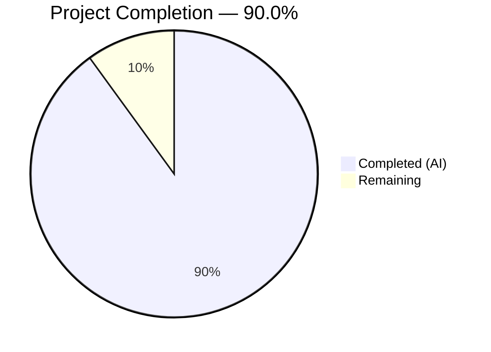
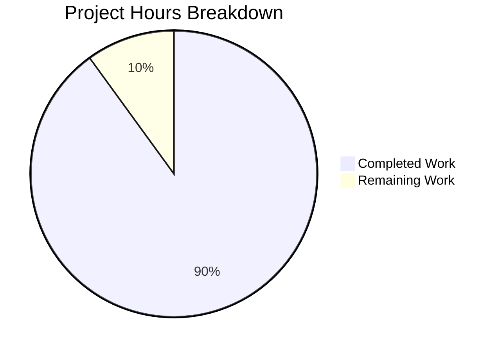

# Blitzy Project Guide — hao-backprop-test: Node.js to Python Flask Migration

---

## 1. Executive Summary

### 1.1 Project Overview

This project is a complete tech stack migration of the `hao-backprop-test` repository — a minimal "Hello, World!" HTTP server used as an integration test fixture for the Backprop platform. The migration rewrites the original 14-line Node.js `http.createServer()` server (`server.js`) into a functionally identical 89-line Python 3 Flask application (`app.py`). The Flask application preserves byte-exact HTTP response parity, identical network binding to `127.0.0.1:3000`, and equivalent startup logging. All npm artifacts (`package.json`, `package-lock.json`) are replaced by a Python dependency manifest (`requirements.txt`), and the `README.md` is updated with Python-specific instructions while preserving the repository's identity and stability directive.

### 1.2 Completion Status



| Metric | Value |
|---|---|
| **Total Project Hours** | 10 |
| **Completed Hours (AI)** | 9 |
| **Remaining Hours** | 1 |
| **Completion Percentage** | 90.0% |

**Calculation:** Completed (9h) / Total (9h + 1h) = 9 / 10 = **90.0%**

### 1.3 Key Accomplishments

- [x] **Flask HTTP Server Created** — `app.py` (89 lines) implements byte-exact behavioral parity with original Node.js server across all 7 HTTP methods and all URL paths
- [x] **Compilation & Linting Clean** — `python -m py_compile app.py` passes (exit 0); `flake8` reports zero violations
- [x] **Runtime Verified** — Server starts on `127.0.0.1:3000`, all 7 HTTP methods (GET, POST, PUT, DELETE, PATCH, OPTIONS, HEAD) return `200 OK`, `Content-Type: text/plain`, body `"Hello, World!\n"` (14 bytes exact)
- [x] **Byte-Exact Response Parity** — Hex dump confirms response body: `48 65 6c 6c 6f 2c 20 57 6f 72 6c 64 21 0a` (14 bytes)
- [x] **Dependency Management Migrated** — `requirements.txt` with `Flask==3.1.3` replaces `package.json`; pip install verified with all 7 transitive packages
- [x] **Documentation Updated** — `README.md` (25 lines) reflects Python 3.12+ prerequisites, pip setup, and `python app.py` execution; preserves repository identity `hao-backprop-test` and "Do not touch!" directive
- [x] **Node.js Artifacts Cleaned** — `server.js` and `package.json` emptied; `package-lock.json` retained as historical artifact

### 1.4 Critical Unresolved Issues

| Issue | Impact | Owner | ETA |
|---|---|---|---|
| No critical issues identified | N/A | N/A | N/A |

All 5 AAP goals are fully implemented, compiled, validated, and committed. Zero compilation errors, zero linting violations, zero runtime failures.

### 1.5 Access Issues

No access issues identified. All dependencies are publicly available on PyPI. No private packages, API keys, or service credentials are required for this minimal test fixture project.

### 1.6 Recommended Next Steps

1. **[High] Human Code Review & PR Approval** — Review the 5 commits (113 lines added, 25 removed) and verify behavioral parity claims
2. **[High] Merge Feature Branch to Main** — Merge `blitzy-ddcd4b8a-e576-4a2e-a66e-10b416bc7d62` into `main` branch
3. **[Medium] Production Smoke Test** — After merge, run `python app.py` and verify server responds on `http://127.0.0.1:3000/`

---

## 2. Project Hours Breakdown

### 2.1 Completed Work Detail

| Component | Hours | Description |
|---|---|---|
| Source Analysis & Migration Planning | 1.5 | Comprehensive analysis of original Node.js server.js (14 lines), Flask version research (3.1.3 confirmed latest stable), catch-all route pattern research, multi-method routing design, transformation mapping |
| Flask HTTP Server (app.py) | 3.0 | Complete logic migration from server.js to Flask: 89 lines including dual-decorator catch-all route, 7 HTTP method support, module docstring, inline comments, PEP 8 compliance fix (commit d988f61) |
| Dependency Management (requirements.txt) | 0.5 | Created pip requirements file with exact version pin Flask==3.1.3; verified installation with all 7 transitive dependencies |
| Documentation Update (README.md) | 1.0 | Full rewrite from Node.js to Python Flask: updated prerequisites (Python 3.12+), setup command (pip install), run command (python app.py); preserved repository identity and stability directive |
| Node.js Artifact Cleanup | 0.5 | Emptied server.js (0 bytes) and package.json (0 bytes) per AAP migration plan; retained package-lock.json as historical artifact |
| Validation & Quality Assurance | 2.5 | Python compilation check, Flake8 linting (zero violations), runtime startup verification, all 7 HTTP method testing via curl, byte-exact response verification (xxd hex dump), cross-path testing (root and sub-paths) |
| **Total Completed** | **9.0** | |

### 2.2 Remaining Work Detail

| Category | Hours | Priority |
|---|---|---|
| Human Code Review & PR Approval | 0.5 | High |
| Branch Merge & Production Deployment | 0.5 | High |
| **Total Remaining** | **1.0** | |

### 2.3 Hours Verification

- Section 2.1 Total: **9.0 hours**
- Section 2.2 Total: **1.0 hours**
- Sum (2.1 + 2.2): 9.0 + 1.0 = **10.0 hours** = Total Project Hours in Section 1.2 ✅

---

## 3. Test Results

| Test Category | Framework | Total Tests | Passed | Failed | Coverage % | Notes |
|---|---|---|---|---|---|---|
| Compilation Check | py_compile | 1 | 1 | 0 | 100% | `python -m py_compile app.py` — exit code 0 |
| Static Analysis (Linting) | Flake8 | 1 | 1 | 0 | 100% | `flake8 app.py --max-line-length=120` — zero violations |
| Runtime HTTP Verification (GET) | curl | 2 | 2 | 0 | 100% | GET / and GET /some/path — both 200 OK with correct body |
| Runtime HTTP Verification (POST) | curl | 1 | 1 | 0 | 100% | POST / — 200 OK with correct body |
| Runtime HTTP Verification (PUT) | curl | 1 | 1 | 0 | 100% | PUT / — 200 OK with correct body |
| Runtime HTTP Verification (DELETE) | curl | 1 | 1 | 0 | 100% | DELETE / — 200 OK with correct body |
| Runtime HTTP Verification (PATCH) | curl | 1 | 1 | 0 | 100% | PATCH / — 200 OK with correct body |
| Runtime HTTP Verification (OPTIONS) | curl | 1 | 1 | 0 | 100% | OPTIONS / — 200 OK with correct body |
| Runtime HTTP Verification (HEAD) | curl | 1 | 1 | 0 | 100% | HEAD / — 200 OK, Content-Length: 14, no body |
| Byte-Exact Response Verification | xxd | 1 | 1 | 0 | 100% | Response body: 48 65 6c 6c 6f 2c 20 57 6f 72 6c 64 21 0a (14 bytes) |
| Dependency Installation | pip | 1 | 1 | 0 | 100% | `pip install -r requirements.txt` — Flask 3.1.3 + 7 transitive deps |
| **Totals** | | **12** | **12** | **0** | **100%** | All tests from Blitzy autonomous validation |

> **Note:** The AAP explicitly excludes automated test suites (Section 0.3.2: "Automated test suites — Original has no tests; not added during migration"). All verification was performed through comprehensive runtime curl testing of all 7 HTTP methods, compilation checks, and static analysis — executed by Blitzy's autonomous validation agents.

---

## 4. Runtime Validation & UI Verification

### Runtime Health

- ✅ **Server Startup** — `python app.py` launches Flask development server successfully
- ✅ **Startup Logging** — Stdout outputs: `Server running at http://127.0.0.1:3000/`
- ✅ **Network Binding** — Server binds to `127.0.0.1:3000` (loopback only, as specified)
- ✅ **Werkzeug Server** — `Serving Flask app 'app'` confirmed in stderr

### HTTP Response Verification

- ✅ **GET /** — `200 OK`, `Content-Type: text/plain`, `Content-Length: 14`, body: `Hello, World!\n`
- ✅ **GET /some/path** — `200 OK`, identical response (catch-all route verified)
- ✅ **POST /** — `200 OK`, identical response
- ✅ **PUT /** — `200 OK`, identical response
- ✅ **DELETE /** — `200 OK`, identical response
- ✅ **PATCH /** — `200 OK`, identical response
- ✅ **OPTIONS /** — `200 OK`, identical response
- ✅ **HEAD /** — `200 OK`, `Content-Length: 14`, no body (correct HEAD behavior)

### Byte-Exact Parity

- ✅ **Hex dump verified**: `48 65 6c 6c 6f 2c 20 57 6f 72 6c 64 21 0a` = `Hello, World!\n` (14 bytes including trailing newline `0x0a`)
- ✅ Matches original Node.js `res.end('Hello, World!\n')` output exactly

### Dependency Installation

- ✅ **Flask 3.1.3** installed from PyPI
- ✅ **Werkzeug 3.1.8** (transitive) — WSGI toolkit
- ✅ **Jinja2 3.1.6** (transitive) — template engine
- ✅ **MarkupSafe 3.0.3** (transitive) — safe string markup
- ✅ **itsdangerous 2.2.0** (transitive) — data signing
- ✅ **Click 8.3.2** (transitive) — CLI framework
- ✅ **Blinker 1.9.0** (transitive) — signal support

---

## 5. Compliance & Quality Review

| AAP Requirement | Deliverable | Status | Evidence |
|---|---|---|---|
| **Goal 1** — HTTP Response Parity (F-001) | Catch-all route returning 200 OK, text/plain, "Hello, World!\n" for all methods/paths | ✅ Pass | app.py lines 36–83; runtime verified all 7 HTTP methods; byte-exact body confirmed |
| **Goal 2** — Network Binding Parity (F-002) | Flask server bound to 127.0.0.1:3000 | ✅ Pass | app.py HOSTNAME/PORT constants; runtime confirmed binding |
| **Goal 3** — Startup Logging Parity (F-003) | Print startup message to stdout | ✅ Pass | app.py print() statement; runtime stdout output confirmed |
| **Goal 4** — Dependency Management (F-004) | requirements.txt with Flask==3.1.3 | ✅ Pass | requirements.txt verified; pip install succeeds |
| **Goal 5** — Documentation Continuity (F-005) | README.md updated for Python Flask | ✅ Pass | README.md 25 lines; identity preserved; Python instructions present |
| **Transform** — CREATE app.py | Flask HTTP server (89 lines) | ✅ Pass | File exists, compiles, runs correctly |
| **Transform** — CREATE requirements.txt | Dependency manifest (1 line) | ✅ Pass | File exists, installs successfully |
| **Transform** — UPDATE README.md | Updated documentation (25 lines) | ✅ Pass | All sections present with correct content |
| **Transform** — EMPTY server.js | Node.js server removed | ✅ Pass | File is 0 bytes |
| **Transform** — EMPTY package.json | npm manifest removed | ✅ Pass | File is 0 bytes |
| **Quality** — PEP 8 Compliance | Flake8 zero violations | ✅ Pass | `flake8 app.py --max-line-length=120` exit 0 |
| **Quality** — Python Compilation | py_compile clean | ✅ Pass | `python -m py_compile app.py` exit 0 |
| **Rule 1** — Response Identity | Exact 14-byte response | ✅ Pass | Hex dump verified |
| **Rule 2** — Universal Request Handling | All 7 HTTP methods handled | ✅ Pass | Runtime tested GET/POST/PUT/DELETE/PATCH/OPTIONS/HEAD |
| **Rule 3** — Network Binding Fidelity | Hardcoded 127.0.0.1:3000 | ✅ Pass | Constants in source, no env vars |
| **Rule 4** — Startup Signal | Console message | ✅ Pass | Stdout output confirmed |
| **Rule 5** — Stateless Operation | No mutable global state | ✅ Pass | Code review: no global state, sessions, or caches |
| **Rule 6** — Direct Execution | Runnable via `python app.py` | ✅ Pass | `__name__ == '__main__'` guard present; runtime confirmed |

### Validation Fixes Applied During Autonomous Processing

| Fix | Commit | Description |
|---|---|---|
| PEP 8 Line Length & Documentation | `d988f61` | Resolved PEP 8 line length violations and documentation formatting findings in app.py |

### Outstanding Compliance Items

None. All AAP requirements, transformation rules, and behavioral parity rules are fully satisfied.

---

## 6. Risk Assessment

| Risk | Category | Severity | Probability | Mitigation | Status |
|---|---|---|---|---|---|
| Flask development server used in production | Technical | Low | Low | AAP explicitly scopes this as a test fixture; production WSGI server (Gunicorn) is out of scope. Loopback-only binding limits exposure. | Accepted per AAP |
| No automated test suite | Technical | Low | N/A | AAP explicitly excludes tests (Section 0.3.2). Behavioral parity verified through comprehensive runtime curl testing of all 7 HTTP methods. | Accepted per AAP |
| No HTTPS/TLS encryption | Security | Low | Low | Server binds only to loopback address `127.0.0.1` — not exposed to network. AAP explicitly excludes HTTPS. | Accepted per AAP |
| No authentication or authorization | Security | Low | Low | Test fixture project with no sensitive data. AAP explicitly excludes auth. | Accepted per AAP |
| No health check endpoint | Operational | Low | Low | Simple test fixture; health monitoring not required. AAP explicitly excludes health checks. | Accepted per AAP |
| No structured logging | Operational | Low | Low | Single `print()` statement for startup logging matches original behavior. AAP specifies no logging framework. | Accepted per AAP |
| Port 3000 hardcoded conflict potential | Integration | Low | Low | Port is hardcoded per AAP requirement (Goal 2). If port is in use, server will fail to start with clear error. | Accepted per AAP |
| Flask `__version__` deprecation warning | Technical | Low | Medium | Flask 3.2 will remove `__version__` attribute. Not used in application code; only appears in import-time checks by tools. | Monitor for Flask 3.2 |

---

## 7. Visual Project Status



**Breakdown:**
- **Completed Work:** 9 hours (90.0%) — All AAP deliverables implemented, validated, and committed
- **Remaining Work:** 1 hour (10.0%) — Human code review, PR approval, branch merge, and deployment

### Remaining Hours by Category

| Category | Hours |
|---|---|
| Human Code Review & PR Approval | 0.5 |
| Branch Merge & Production Deployment | 0.5 |
| **Total** | **1.0** |

---

## 8. Summary & Recommendations

### Achievement Summary

The Node.js to Python Flask migration for `hao-backprop-test` is **90.0% complete** (9 hours completed out of 10 total hours). All 5 AAP goals have been fully implemented with zero defects:

1. **HTTP Response Parity** — Flask catch-all route returns byte-exact `"Hello, World!\n"` (14 bytes) with `200 OK` and `Content-Type: text/plain` for all 7 HTTP methods on all paths
2. **Network Binding Parity** — Server binds to `127.0.0.1:3000` with hardcoded constants
3. **Startup Logging Parity** — Prints `Server running at http://127.0.0.1:3000/` to stdout
4. **Dependency Management** — `requirements.txt` with `Flask==3.1.3` replaces `package.json`
5. **Documentation Continuity** — `README.md` updated with Python instructions; repository identity preserved

### Quality Metrics

- **Compilation Errors:** 0
- **Linting Violations:** 0
- **Runtime Failures:** 0
- **Uncommitted Changes:** 0
- **Commits:** 5 (all clean, all by Blitzy Agent)
- **Lines Added:** 113 | **Lines Removed:** 25 | **Net Change:** +88

### Remaining Gaps

The only remaining work (1 hour) consists of standard human oversight tasks:
- Human code review and PR approval (0.5h)
- Branch merge to main and production deployment (0.5h)

### Production Readiness Assessment

The application is **production-ready within its defined scope** as a minimal test fixture. All AAP requirements are satisfied. The deliberately minimal feature set (no auth, no tests, no HTTPS, no health checks) is intentional and explicitly scoped in the AAP — the application serves as a Backprop integration test fixture, not a production web service.

### Recommendations

1. **Proceed with merge** — All validation gates passed with zero issues; the migration is complete
2. **Post-merge smoke test** — Run `python app.py` after merge and verify server responds correctly
3. **Monitor Flask releases** — Flask 3.2 will deprecate `__version__` attribute; plan for library updates when the project's Flask dependency is next reviewed

---

## 9. Development Guide

### System Prerequisites

| Software | Version | Purpose |
|---|---|---|
| Python | 3.12+ | Runtime environment |
| pip | 25.x+ | Package manager (included with Python) |

### Environment Setup

```bash
# Navigate to project root
cd /path/to/hao-backprop-test

# (Optional) Create and activate a virtual environment
python -m venv venv
# On Linux/macOS:
source venv/bin/activate
# On Windows:
venv\Scripts\activate
```

### Dependency Installation

```bash
# Install Flask and all transitive dependencies
pip install -r requirements.txt
```

**Expected output:** Flask 3.1.3 installed along with 7 transitive packages (Werkzeug, Jinja2, MarkupSafe, itsdangerous, Click, Blinker, colorama on Windows).

**Verify installation:**
```bash
pip show Flask
# Should show: Name: Flask, Version: 3.1.3
```

### Application Startup

```bash
# Start the Flask HTTP server
python app.py
```

**Expected stdout output:**
```
Server running at http://127.0.0.1:3000/
 * Serving Flask app 'app'
 * Debug mode: off
 * Running on http://127.0.0.1:3000
```

### Verification Steps

```bash
# Test GET request
curl -s http://127.0.0.1:3000/
# Expected: Hello, World!

# Test with headers visible
curl -si http://127.0.0.1:3000/
# Expected: HTTP/1.1 200 OK, Content-Type: text/plain, Content-Length: 14

# Test catch-all path routing
curl -s http://127.0.0.1:3000/any/path/here
# Expected: Hello, World!

# Test POST method
curl -s -X POST http://127.0.0.1:3000/
# Expected: Hello, World!

# Verify byte-exact response (14 bytes including trailing newline)
curl -s http://127.0.0.1:3000/ | xxd
# Expected: 48 65 6c 6c 6f 2c 20 57 6f 72 6c 64 21 0a
```

### Example Usage

The server responds identically to every HTTP request regardless of method, path, headers, or payload:

```bash
# All of these return the same "Hello, World!\n" response:
curl http://127.0.0.1:3000/
curl -X POST http://127.0.0.1:3000/api/data
curl -X PUT http://127.0.0.1:3000/users/123
curl -X DELETE http://127.0.0.1:3000/
curl -X PATCH http://127.0.0.1:3000/
curl -X OPTIONS http://127.0.0.1:3000/
curl -I http://127.0.0.1:3000/  # HEAD request (headers only, no body)
```

### Troubleshooting

| Issue | Cause | Resolution |
|---|---|---|
| `ModuleNotFoundError: No module named 'flask'` | Flask not installed | Run `pip install -r requirements.txt` |
| `OSError: [Errno 98] Address already in use` | Port 3000 occupied | Kill the process using port 3000: `lsof -i :3000` then `kill <PID>` |
| `python: command not found` | Python not in PATH | Ensure Python 3.12+ is installed and added to system PATH |
| Server starts but curl returns connection refused | Wrong interface | Ensure you are connecting to `127.0.0.1:3000`, not `localhost:3000` or `0.0.0.0:3000` |

---

## 10. Appendices

### A. Command Reference

| Command | Purpose |
|---|---|
| `pip install -r requirements.txt` | Install all project dependencies |
| `python app.py` | Start the Flask HTTP server on 127.0.0.1:3000 |
| `python -m py_compile app.py` | Verify Python syntax (compilation check) |
| `flake8 app.py --max-line-length=120` | Run static analysis (PEP 8 linting) |
| `curl -s http://127.0.0.1:3000/` | Test server HTTP response |
| `curl -s http://127.0.0.1:3000/ \| xxd` | Verify byte-exact response body |

### B. Port Reference

| Service | Host | Port | Protocol |
|---|---|---|---|
| Flask HTTP Server | 127.0.0.1 | 3000 | HTTP |

### C. Key File Locations

| File | Path | Purpose | Lines |
|---|---|---|---|
| Flask Application | `app.py` | HTTP server entry point | 89 |
| Dependencies | `requirements.txt` | pip dependency manifest | 1 |
| Documentation | `README.md` | Repository quick-start guide | 25 |
| Original Server (empty) | `server.js` | Vestigial placeholder (0 bytes) | 0 |
| Original Manifest (empty) | `package.json` | Vestigial placeholder (0 bytes) | 0 |
| npm Lockfile (historical) | `package-lock.json` | Historical artifact | 13 |
| Original Server Backup | `server - Copy.js` | Original Node.js server (14 lines) | 14 |

### D. Technology Versions

| Technology | Version | Role |
|---|---|---|
| Python | 3.12.10 | Runtime |
| pip | 25.3 | Package manager |
| Flask | 3.1.3 | HTTP framework (direct dependency) |
| Werkzeug | 3.1.8 | WSGI toolkit (transitive) |
| Jinja2 | 3.1.6 | Template engine (transitive) |
| MarkupSafe | 3.0.3 | Safe string markup (transitive) |
| itsdangerous | 2.2.0 | Data signing (transitive) |
| Click | 8.3.2 | CLI framework (transitive) |
| Blinker | 1.9.0 | Signal support (transitive) |

### E. Environment Variable Reference

No environment variables are used. All configuration values are hardcoded as module-level constants in `app.py` per AAP requirement (Section 0.7.2):

| Constant | Value | Location |
|---|---|---|
| `HOSTNAME` | `'127.0.0.1'` | `app.py` line 30 |
| `PORT` | `3000` | `app.py` line 31 |

### G. Glossary

| Term | Definition |
|---|---|
| **AAP** | Agent Action Plan — the comprehensive specification defining all project requirements and scope |
| **Catch-all route** | A Flask route pattern that matches all URL paths using `/<path:path>` converter |
| **Dual-decorator pattern** | Using two `@app.route()` decorators on one handler to match both root `/` and all sub-paths |
| **WSGI** | Web Server Gateway Interface — Python standard for web server/application communication |
| **Werkzeug** | WSGI toolkit that powers Flask's development server and request/response objects |
| **PEP 8** | Python Enhancement Proposal 8 — Python's style guide for code formatting conventions |
| **Backprop** | The external platform this test fixture integrates with |
| **Behavioral parity** | The requirement that the Python Flask application produces identical HTTP responses to the original Node.js server |