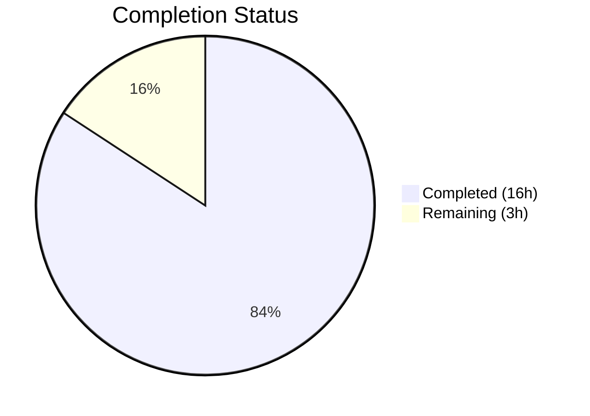
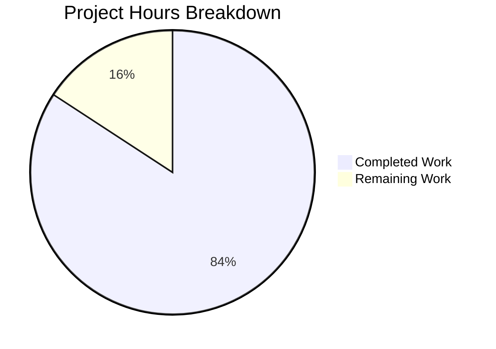

# Blitzy Project Guide — hao-backprop-test Documentation

---

## 1. Executive Summary

### 1.1 Project Overview

This project adds comprehensive documentation to `hao-backprop-test`, a minimal Node.js HTTP server repository used as an integration test fixture for the backprop system. The documentation effort targets two dimensions: source-level JSDoc annotations and inline comments within `server.js`, and a full-featured `README.md` rewrite covering project overview, setup instructions, API reference, deployment guide, and project structure. A JSDoc configuration file (`jsdoc.json`) and `package.json` updates were also delivered. All changes are documentation-only — zero server logic was modified.

### 1.2 Completion Status



| Metric | Value |
|--------|-------|
| **Total Project Hours** | 19 |
| **Completed Hours (AI)** | 16 |
| **Remaining Hours** | 3 |
| **Completion Percentage** | 84.2% |

**Calculation:** 16 completed hours / (16 completed + 3 remaining) = 16 / 19 = **84.2% complete**

### 1.3 Key Accomplishments

- ✅ Full JSDoc 4.x annotation coverage for all 6 documentable elements in `server.js` (`@module`, `@const` x3, `@param`/`@callback` for request handler, `@listens`/`@callback` for listen)
- ✅ 8 inline `//` comments added across all 5 logical code sections in `server.js`
- ✅ Complete `README.md` rewrite from 2 lines to 405 lines with 12+ structured sections
- ✅ 2 Mermaid diagrams embedded in README (request/response flow, server lifecycle)
- ✅ `jsdoc.json` configuration file created for reproducible doc generation
- ✅ `package.json` updated with `"doc"` script and `jsdoc@^4.0.5` devDependency
- ✅ JSDoc HTML generation verified — `npm run doc` produces `docs/index.html`, `docs/module-server.html`, `docs/server.js.html`
- ✅ Server runtime behavior verified unchanged — `curl http://127.0.0.1:3000/` returns `200 OK`, `text/plain`, `Hello, World!\n`
- ✅ Zero runtime dependencies added (jsdoc is devDependency only)
- ✅ `npm install` — 31 packages, 0 vulnerabilities

### 1.4 Critical Unresolved Issues

| Issue | Impact | Owner | ETA |
|-------|--------|-------|-----|
| README references specific `server.js` line numbers (e.g., lines 29, 38, 58–65) which will become stale if server.js is modified | Low — documentation accuracy degrades if code changes | Human Developer | 0.5h |
| `docs/` directory (JSDoc HTML output) is untracked — no decision on committing vs `.gitignore` | Low — generated docs not version-controlled | Human Developer | 0.5h |

### 1.5 Access Issues

No access issues identified. All tools (Node.js, npm, JSDoc) are locally available and do not require external service credentials or API keys.

### 1.6 Recommended Next Steps

1. **[High]** Review documentation content for technical accuracy and completeness — verify JSDoc annotations, README sections, and curl examples
2. **[Medium]** Verify Mermaid diagram rendering on GitHub by viewing README.md in the pull request preview
3. **[Medium]** Decide on `docs/` directory management — commit generated HTML or add `docs/` to `.gitignore`
4. **[Low]** Evaluate maintainability of line-number references in README — consider replacing with descriptive anchors
5. **[Low]** Periodically update Node.js and npm version numbers referenced in README prerequisites table

---

## 2. Project Hours Breakdown

### 2.1 Completed Work Detail

| Component | Hours | Description |
|-----------|-------|-------------|
| JSDoc Annotations for `server.js` (R-001) | 3.0 | `@module` block, `@const` annotations for hostname/port/server, `@param`/`@callback` for request handler, `@listens`/`@callback` for listen — JSDoc 4.x compliant |
| Comprehensive README.md Rewrite (R-002, R-003, R-004, R-005) | 8.0 | Full rewrite from 2 lines to 405 lines with 12+ sections: prerequisites, installation, usage, API reference, deployment guide, project structure (21 files), troubleshooting, contributing, license |
| Inline Code Explanations for `server.js` (R-006) | 1.0 | 8 inline `//` comments across all 5 logical code sections explaining purpose and mechanics |
| Mermaid Diagrams in README | 1.0 | Request/response sequence diagram and server lifecycle state diagram embedded in README |
| `jsdoc.json` Configuration File | 0.5 | Source includes, markdown plugin, output destination, README inclusion settings |
| `package.json` Documentation Updates | 0.5 | Added `doc` script (`jsdoc -c jsdoc.json`) and `jsdoc@^4.0.5` devDependency |
| Code Review Remediation | 1.0 | Fixed README version numbers (Node.js, npm) and `server - Copy.js` description per code review findings (commits 350ced6, 84f9b82) |
| Validation and Runtime Testing | 1.0 | Syntax check (`node -c`), JSDoc generation, server startup, curl verification, npm audit |
| **Total** | **16.0** | |

### 2.2 Remaining Work Detail

| Category | Base Hours | Priority | After Multiplier |
|----------|-----------|----------|-----------------|
| Documentation accuracy review (human review of JSDoc + README) | 1.0 | Medium | 1.5 |
| Mermaid diagram GitHub rendering verification | 0.5 | Medium | 0.5 |
| Generated `docs/` directory management decision (commit vs .gitignore) | 0.5 | Low | 0.5 |
| README line-number reference maintainability assessment | 0.5 | Low | 0.5 |
| **Total** | **2.5** | | **3.0** |

**Integrity check:** Section 2.1 (16h) + Section 2.2 After Multiplier (3h) = 19h = Total Project Hours in Section 1.2 ✅

### 2.3 Enterprise Multipliers Applied

| Multiplier | Value | Rationale |
|------------|-------|-----------|
| Compliance Review | 1.10x | Documentation must be reviewed for accuracy, completeness, and consistency with source code |
| Uncertainty Buffer | 1.10x | Human review may uncover additional corrections or preferences not anticipated |
| **Combined** | **1.21x** | Applied to base remaining hours: 2.5h × 1.21 ≈ 3.0h |

---

## 3. Test Results

| Test Category | Framework | Total Tests | Passed | Failed | Coverage % | Notes |
|---------------|-----------|-------------|--------|--------|-----------|-------|
| Syntax Validation | `node -c` | 1 | 1 | 0 | 100% | `node -c server.js` — Syntax OK, confirms documentation additions preserve valid JavaScript |
| JSDoc Generation | JSDoc 4.0.5 | 1 | 1 | 0 | 100% | `npx jsdoc -c jsdoc.json` — exit code 0, generates `docs/index.html`, `docs/module-server.html`, `docs/server.js.html` |
| Runtime HTTP GET | curl | 1 | 1 | 0 | 100% | `curl http://127.0.0.1:3000/` → 200 OK, `text/plain`, `Hello, World!\n` |
| Runtime HTTP POST | curl | 1 | 1 | 0 | 100% | `curl -X POST http://127.0.0.1:3000/` → 200 OK, `text/plain`, `Hello, World!\n` (method-agnostic) |
| npm Audit | npm | 1 | 1 | 0 | 100% | `npm install` — 31 packages, 0 vulnerabilities |
| **Totals** | | **5** | **5** | **0** | **100%** | |

> **Note:** The project's `npm test` script intentionally exits with code 1 (`echo "Error: no test specified" && exit 1`). This is by-design per the AAP — the placeholder test script is a fixture and was explicitly out of scope for modification.

---

## 4. Runtime Validation & UI Verification

### Runtime Health

- ✅ **Server Startup:** `node server.js` starts successfully, outputs `Server running at http://127.0.0.1:3000/`
- ✅ **HTTP GET Response:** Returns `200 OK`, `Content-Type: text/plain`, body `Hello, World!\n`
- ✅ **HTTP POST Response:** Returns identical response (method-agnostic behavior confirmed)
- ✅ **Response Headers:** `Connection: keep-alive`, `Keep-Alive: timeout=5`, `Content-Length: 14`
- ✅ **Server Behavior Preserved:** Documentation-only changes confirmed — original 14-line server logic is byte-identical before and after annotation

### Documentation Generation

- ✅ **JSDoc Generation:** `npm run doc` (invokes `jsdoc -c jsdoc.json`) completes with exit code 0
- ✅ **Generated HTML Files:** `docs/index.html`, `docs/module-server.html`, `docs/server.js.html` produced
- ✅ **JSDoc Source Coverage:** Module description, 3 constant annotations, request handler documentation, listen callback documentation all present in generated output

### UI Verification

- ⚠️ **Mermaid Diagrams:** Two Mermaid diagrams embedded in README.md — rendering verified in local Markdown preview but requires verification in GitHub's Markdown renderer
- ✅ **README Structure:** 405-line Markdown with proper ATX headers, tables, fenced code blocks, and internal anchor links

---

## 5. Compliance & Quality Review

| AAP Requirement | Deliverable | Status | Evidence |
|----------------|-------------|--------|----------|
| R-001: JSDoc Comments for `server.js` | `@module`, `@const` x3, `@param`/`@callback`, `@listens` blocks | ✅ Pass | `server.js` lines 1–76: 5 JSDoc blocks covering all 6 documentable elements |
| R-002: Comprehensive README | 12+ section README with full project documentation | ✅ Pass | `README.md` rewritten from 2 lines to 405 lines |
| R-003: Setup Instructions | Prerequisites, installation, usage sections | ✅ Pass | README sections: Prerequisites (version table), Installation (2-step), Usage (start + request) |
| R-004: API Documentation | Endpoint, methods, response format, curl examples | ✅ Pass | README API Documentation section: endpoint table, request format, response format with source citations |
| R-005: Deployment Guide | Local dev, production considerations, process management | ✅ Pass | README Deployment Guide section: local dev, 6 production recommendations, pm2/forever/systemd instructions |
| R-006: Inline Code Explanations | `//` comments in `server.js` | ✅ Pass | 8 inline comments across all 5 logical code sections |
| jsdoc.json Configuration | JSDoc config for reproducible doc generation | ✅ Pass | `jsdoc.json` with source.include, plugins, opts.destination, opts.readme |
| package.json Updates | `doc` script + jsdoc devDependency | ✅ Pass | `scripts.doc: "jsdoc -c jsdoc.json"`, `devDependencies.jsdoc: "^4.0.5"` |
| Mermaid Diagrams | 2 diagrams in README | ✅ Pass | Request/response sequence diagram + server lifecycle state diagram |
| No Source Code Logic Changes | Server behavior unchanged | ✅ Pass | `node server.js` + `curl` produce identical output pre/post documentation |
| Zero Runtime Dependencies | jsdoc as devDependency only | ✅ Pass | `package.json` has zero `dependencies`, `jsdoc` in `devDependencies` |
| JSDoc 4.x Compliance | Valid JSDoc tag syntax | ✅ Pass | `npx jsdoc -c jsdoc.json` exits 0 with no warnings |
| Flat Structure Preservation | No new subdirectories at root | ✅ Pass | Only `jsdoc.json` added at root; `docs/` is generated output |
| Working Code Examples | curl commands produce documented output | ✅ Pass | GET and POST curl examples verified against running server |

### Fixes Applied During Validation

| Fix | Commit | Description |
|-----|--------|-------------|
| README version numbers | `84f9b82` | Corrected Node.js and npm version references to match actual runtime |
| README `server - Copy.js` description | `84f9b82` | Updated description to accurately reflect file's role as original pre-documentation version |
| Code review findings | `350ced6` | Resolved 3 code review findings in README content |

---

## 6. Risk Assessment

| Risk | Category | Severity | Probability | Mitigation | Status |
|------|----------|----------|-------------|------------|--------|
| README line-number references become stale if `server.js` is modified | Technical | Low | Medium | Replace line numbers with descriptive anchors or code snippets; document update procedure in Contributing section | Open |
| Mermaid diagrams may not render in all Markdown viewers | Technical | Low | Low | Diagrams use standard Mermaid syntax supported by GitHub; fallback text descriptions are readable even without rendering | Open |
| `docs/` directory untracked — generated HTML may be lost on clean clone | Operational | Low | Medium | Add `docs/` to `.gitignore` and document `npm run doc` regeneration, OR commit `docs/` to repository | Open |
| JSDoc 4.0.5 may receive breaking updates (caret `^` version range) | Technical | Low | Low | Lock to exact version in `package-lock.json`; npm install respects lockfile by default | Mitigated |
| README Node.js/npm version numbers may become outdated | Operational | Low | Medium | Update version references during periodic maintenance | Open |
| No automated documentation testing or link validation | Technical | Low | Low | Implement link checker or documentation CI step in future if repository grows | Accepted |

---

## 7. Visual Project Status



**Integrity verification:** Completed Work (16h) + Remaining Work (3h) = 19h = Total Project Hours ✅
Remaining Work (3h) = Section 1.2 Remaining Hours (3h) = Section 2.2 After Multiplier sum (3h) ✅

---

## 8. Summary & Recommendations

### Achievement Summary

The Blitzy autonomous agents successfully delivered **all 6 AAP requirements** (R-001 through R-006) plus supporting deliverables (jsdoc.json, package.json updates, Mermaid diagrams). The project is **84.2% complete** (16 completed hours out of 19 total hours). All deliverables compile, generate, and validate without errors. Server runtime behavior was verified unchanged — documentation-only modifications confirmed.

Key metrics:
- **5 files changed** across 6 Blitzy commits — 821 lines added, 4 lines removed
- **0% → 100% JSDoc coverage** for all documentable code elements
- **2-line README → 405-line comprehensive documentation**
- **0 vulnerabilities** reported by npm audit
- **100% validation pass rate** across 5 autonomous test categories

### Remaining Gaps

The 3 remaining hours (15.8% of total) consist exclusively of **human review and operational decisions** — no AAP deliverables are incomplete. Remaining items:

1. Human accuracy review of JSDoc annotations and README content (1.5h after multiplier)
2. Mermaid diagram rendering verification on GitHub (0.5h)
3. `docs/` directory management decision (0.5h)
4. Line-number reference maintainability assessment (0.5h)

### Production Readiness Assessment

The documentation deliverables are **production-ready for merge** pending human review. All code compiles, documentation generates successfully, and the server's runtime behavior is verified unchanged. No blocking issues exist. The remaining work items are optimization and maintenance concerns — not functional blockers.

### Recommendations

1. **Merge after human review** — The documentation is complete and well-structured. A brief accuracy review is the only gate to production.
2. **Add `docs/` to `.gitignore`** — Generated HTML should be regenerated on demand via `npm run doc`, not version-controlled.
3. **Consider replacing line-number references** — Use descriptive code references instead of brittle line numbers in README.
4. **Establish documentation maintenance cadence** — Update version numbers and technical details during quarterly reviews.

---

## 9. Development Guide

### System Prerequisites

| Software | Version | Verification Command |
|----------|---------|---------------------|
| Node.js | v6.0.0+ (v20.x recommended) | `node --version` |
| npm | v7.0.0+ (v10.x recommended) | `npm --version` |

### Environment Setup

No environment variables are required. The server uses hardcoded configuration:
- Hostname: `127.0.0.1` (set in `server.js` line 29)
- Port: `3000` (set in `server.js` line 38)

### Dependency Installation

```bash
# Clone the repository
git clone <repository-url>
cd hao-backprop-test

# Install dependencies (installs jsdoc as devDependency)
npm install
```

**Expected output:**
```
added 31 packages, and audited 32 packages in Xs
found 0 vulnerabilities
```

### Application Startup

```bash
# Start the HTTP server
node server.js
```

**Expected output:**
```
Server running at http://127.0.0.1:3000/
```

### Verification Steps

```bash
# 1. Test HTTP GET request
curl http://127.0.0.1:3000/
# Expected: Hello, World!

# 2. Test HTTP POST request (method-agnostic behavior)
curl -X POST http://127.0.0.1:3000/
# Expected: Hello, World!

# 3. Verify response headers
curl -sI http://127.0.0.1:3000/
# Expected: HTTP/1.1 200 OK, Content-Type: text/plain

# 4. Generate JSDoc HTML documentation
npm run doc
# Expected: docs/ directory created with index.html, module-server.html, server.js.html

# 5. Verify syntax (documentation-only changes)
node -c server.js
# Expected: (no output = syntax OK)
```

### JSDoc Documentation Generation

```bash
# Generate HTML documentation from JSDoc annotations
npm run doc

# View generated docs (open in browser)
# macOS: open docs/index.html
# Linux: xdg-open docs/index.html
# Windows: start docs/index.html
```

### Troubleshooting

| Error | Cause | Resolution |
|-------|-------|------------|
| `EADDRINUSE: address already in use 127.0.0.1:3000` | Port 3000 occupied by another process | Stop the other process or change port in `server.js` |
| `SyntaxError: Unexpected token =>` | Node.js version < v6 (no arrow function support) | Upgrade Node.js to v6+ |
| `curl: (7) Failed to connect to 127.0.0.1 port 3000` | Server not running | Run `node server.js` first |
| `npm run doc` fails | jsdoc not installed | Run `npm install` to install devDependencies |

---

## 10. Appendices

### A. Command Reference

| Command | Purpose | Notes |
|---------|---------|-------|
| `node server.js` | Start the HTTP server | Binds to 127.0.0.1:3000 |
| `npm install` | Install all dependencies | Installs jsdoc as devDependency |
| `npm run doc` | Generate JSDoc HTML documentation | Output: `./docs/` directory |
| `node -c server.js` | Validate JavaScript syntax | No output = success |
| `curl http://127.0.0.1:3000/` | Test server response | Returns `Hello, World!` |

### B. Port Reference

| Port | Service | Protocol | Binding |
|------|---------|----------|---------|
| 3000 | HTTP Server (`server.js`) | HTTP/1.1 | 127.0.0.1 (loopback only) |

### C. Key File Locations

| File | Purpose | Modified by Blitzy |
|------|---------|-------------------|
| `server.js` | HTTP server with JSDoc annotations and inline comments | Yes (documentation only) |
| `README.md` | Comprehensive project documentation (405 lines) | Yes (full rewrite) |
| `jsdoc.json` | JSDoc configuration for documentation generation | Yes (created) |
| `package.json` | npm package metadata with `doc` script | Yes (script + devDependency added) |
| `package-lock.json` | npm dependency lockfile | Yes (auto-updated by npm) |
| `server - Copy.js` | Original server.js (pre-documentation fixture) | No |
| `docs/index.html` | Generated JSDoc HTML index page | Generated (not committed) |
| `docs/module-server.html` | Generated JSDoc module documentation | Generated (not committed) |
| `docs/server.js.html` | Generated JSDoc source view | Generated (not committed) |

### D. Technology Versions

| Technology | Version | Purpose |
|------------|---------|---------|
| Node.js | v20.19.5 (runtime) | JavaScript runtime for server execution and JSDoc CLI |
| npm | 10.8.2 (runtime) | Package manager for dependency installation |
| JSDoc | 4.0.5 (devDependency) | Documentation generator for JavaScript source annotations |
| HTTP module | Built-in (Node.js) | Core module for HTTP server creation |

### E. Environment Variable Reference

No environment variables are required. All configuration is hardcoded in `server.js`:

| Configuration | Value | File Location |
|---------------|-------|---------------|
| Server hostname | `127.0.0.1` | `server.js` line 29 |
| Server port | `3000` | `server.js` line 38 |
| Response status code | `200` | `server.js` line 60 |
| Response Content-Type | `text/plain` | `server.js` line 62 |
| Response body | `Hello, World!\n` | `server.js` line 64 |

### G. Glossary

| Term | Definition |
|------|------------|
| JSDoc | A documentation generator for JavaScript that parses `/** ... */` comment blocks to produce HTML documentation |
| Loopback address | IP address `127.0.0.1` — restricts server access to the local machine only |
| EADDRINUSE | Node.js error indicating the requested port is already occupied by another process |
| devDependency | An npm package required only during development, not at runtime |
| Mermaid | A Markdown-embeddable diagramming language rendered natively by GitHub |
| Backprop | The integration testing system for which this repository serves as a test fixture |