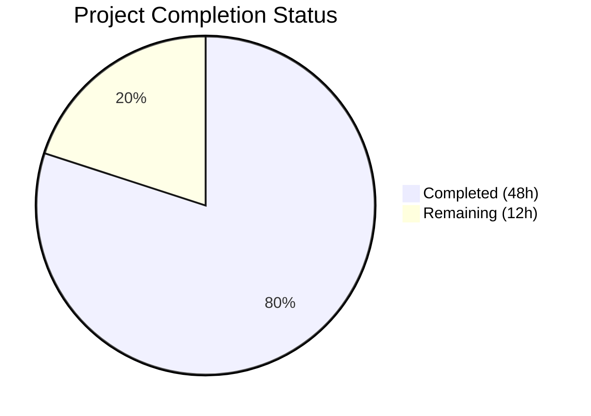

# Blitzy Project Guide

---

## 1. Executive Summary

### 1.1 Project Overview

This project delivers a comprehensive OWASP-aligned security hardening of a Node.js HTTP server application. The original `server.js` was a 14-line bare `http.createServer()` endpoint serving "Hello, World!" with zero security controls. Blitzy agents migrated it to Express.js 4.22.1 and integrated five security middleware layers: helmet for HTTP security headers, cors for cross-origin access control, express-rate-limit for DDoS/brute-force protection, express-validator for input sanitization, and Node.js HTTPS module for TLS encryption. The security hardening addresses OWASP Top 10 categories A01 (Broken Access Control), A02 (Cryptographic Failures), A03 (Injection), A04 (Insecure Design), and A05 (Security Misconfiguration). Backward compatibility with the existing GET / endpoint is fully preserved.

### 1.2 Completion Status



| Metric | Value |
|--------|-------|
| **Total Project Hours** | 60 |
| **Completed Hours (AI)** | 48 |
| **Remaining Hours** | 12 |
| **Completion Percentage** | 80.0% |

**Calculation:** 48 completed hours / (48 completed + 12 remaining) = 48 / 60 = **80.0% complete**

### 1.3 Key Accomplishments

- ✅ Migrated `server.js` from bare `http.createServer()` to Express 4.22.1 with full middleware architecture
- ✅ Integrated helmet@8.1.0 — 11+ HTTP security headers set on every response (CSP, HSTS, X-Content-Type-Options, Cross-Origin-Opener-Policy, Cross-Origin-Resource-Policy, Referrer-Policy, X-DNS-Prefetch-Control) and X-Powered-By removed
- ✅ Integrated cors@2.8.6 — explicit origin allowlisting with automatic preflight handling (no wildcard `*`)
- ✅ Integrated express-rate-limit@8.3.2 — 100 requests/15-minute per-IP threshold with draft-8 RateLimit response headers
- ✅ Integrated express-validator@7.3.1 — body/query sanitization, Content-Type enforcement, structured validation error responses
- ✅ Added HTTPS/TLS server capability with configurable certificate paths via environment variables
- ✅ Created centralized security configuration module (`config/security.js`) with environment-variable-driven settings
- ✅ Created 30 security tests across 4 test suites — all passing (100% pass rate)
- ✅ npm audit reports 0 vulnerabilities across entire dependency tree
- ✅ Backward compatibility preserved — GET / returns 200 OK with "Hello, World!\n"
- ✅ Custom global error handler prevents stack trace and file path leakage (OWASP A05:2021)
- ✅ Zero TODOs, FIXMEs, or placeholder code in the codebase

### 1.4 Critical Unresolved Issues

| Issue | Impact | Owner | ETA |
|-------|--------|-------|-----|
| No production TLS certificates | HTTPS server cannot start without certs; traffic remains unencrypted | Human Developer | 2 hours |
| CORS allows only localhost | Cross-origin requests from production domains will be blocked | Human Developer | 0.5 hours |
| Rate-limit uses in-memory store | Rate limits not shared across server instances in multi-instance deployments | Human Developer | 3 hours |

### 1.5 Access Issues

No access issues identified. All dependencies were installed from the public npm registry. No private packages, API keys, or external service credentials are required for the core application to run.

### 1.6 Recommended Next Steps

1. **[High]** Obtain production TLS certificates (CA-signed or Let's Encrypt) and configure `TLS_CERT_PATH` and `TLS_KEY_PATH` environment variables
2. **[High]** Configure `CORS_ORIGINS` environment variable with production domain(s) for cross-origin access
3. **[Medium]** Replace in-memory rate-limit store with Redis (`rate-limit-redis`) for multi-instance deployment support
4. **[Medium]** Add HTTP-to-HTTPS redirect middleware for production to enforce encrypted transport
5. **[Low]** Integrate security test suite into CI/CD pipeline with `npm audit` checks on every build

---

## 2. Project Hours Breakdown

### 2.1 Completed Work Detail

| Component | Hours | Description |
|-----------|-------|-------------|
| Express.js Framework Migration | 8 | Migrated server.js from 14-line bare `http.createServer()` to 190-line Express 4.22.1 app with middleware stack, route handlers, global error handler, HTTPS bootstrap, and module.exports for testing |
| Security Headers (Helmet) | 3 | Integrated helmet@8.1.0 as first middleware; configures CSP directives, sets 11+ security headers, removes X-Powered-By header |
| Input Validation Middleware | 5 | Created middleware/validation.js (134 lines) with express-validator@7.3.1 — sanitizeBody, sanitizeQuery, validateContentType, handleValidationErrors exports |
| Rate Limiting | 2 | Configured express-rate-limit@8.3.2 with 100 req/15min per IP, draft-8 RateLimit headers, disabled legacy headers |
| HTTPS/TLS Support | 4 | Added conditional HTTPS server bootstrap in server.js, TLS config in config/security.js, and certs/README.md (126 lines) with OpenSSL self-signed cert instructions |
| CORS Policy | 2 | Integrated cors@2.8.6 with explicit origin allowlisting from config, preflight OPTIONS handling, credentials support |
| Security Configuration Module | 3 | Created config/security.js (129 lines) — single-source-of-truth for CORS origins, rate-limit settings, CSP directives, TLS paths, ports; all environment-variable-driven with secure defaults |
| Security Middleware Module | 2 | Created middleware/security.js (80 lines) — exports configured helmetMiddleware, corsMiddleware, rateLimitMiddleware ready for app.use() |
| Dependency Management | 3 | Added 5 production dependencies (express, helmet, cors, express-rate-limit, express-validator) + 2 dev dependencies (jest, supertest) to package.json; regenerated package-lock.json (4,907 lines); npm audit clean |
| Security Test Suite | 10 | Created 4 test files (562 lines, 30 tests): test_security_headers.js (11 tests), test_cors.js (7 tests), test_input_validation.js (7 tests), test_rate_limiting.js (5 tests) — all passing |
| Code Quality & Bug Fixes | 4 | Multiple fix commits: Express 4.21.2→4.22.1 upgrade for transitive vulnerability fixes, middleware reordering (security before body parsers), custom error handler, isNaN-safe parseInt, CORS trim, dead import removal |
| Validation & QA | 2 | Runtime verification via curl: security headers present, rate limiting active (429 after threshold), CORS policy enforced, backward compatibility confirmed, HTTPS config validated |
| **Total** | **48** | |

### 2.2 Remaining Work Detail

| Category | Hours | Priority |
|----------|-------|----------|
| Production TLS Certificate Setup — Obtain CA-signed certificates (or Let's Encrypt), configure TLS_CERT_PATH and TLS_KEY_PATH environment variables, verify HTTPS startup | 2 | High |
| Production Environment Configuration — Set CORS_ORIGINS with production domains, tune RATE_LIMIT_MAX and RATE_LIMIT_WINDOW_MS for production traffic patterns, configure PORT and HTTPS_PORT | 1.5 | High |
| External Rate-Limit Store (Redis) — Replace built-in memory store with `rate-limit-redis` for rate-limit sharing across multiple server instances in scaled deployments | 3 | Medium |
| HTTP-to-HTTPS Redirect Middleware — Add Express middleware to redirect all HTTP requests to HTTPS in production environments | 1 | Medium |
| Security Logging & Monitoring — Implement structured logging for rate-limit violations, CORS rejections, and validation failures; integrate with monitoring/alerting system | 2.5 | Medium |
| CI/CD Pipeline Integration — Add npm audit and security test execution to CI/CD pipeline; configure automated dependency vulnerability scanning on each build | 2 | Low |
| **Total** | **12** | |

---

## 3. Test Results

| Test Category | Framework | Total Tests | Passed | Failed | Coverage % | Notes |
|--------------|-----------|-------------|--------|--------|------------|-------|
| Security Headers | Jest + Supertest | 11 | 11 | 0 | N/A | Validates all helmet-set headers (CSP, HSTS, X-Content-Type-Options, COOP, CORP, Referrer-Policy, X-DNS-Prefetch-Control), X-Powered-By removal, and backward compatibility |
| CORS Policy | Jest + Supertest | 7 | 7 | 0 | N/A | Validates allowed/disallowed origins, preflight OPTIONS handling, allowed methods, credentials header, and no-Origin requests |
| Input Validation | Jest + Supertest | 7 | 7 | 0 | N/A | Validates XSS payload handling, SQL injection handling, oversized body rejection, malformed JSON handling, Content-Type enforcement |
| Rate Limiting | Jest + Supertest | 5 | 5 | 0 | N/A | Validates under-limit requests pass, RateLimit headers present, legacy headers absent, 429 response on threshold, error message format |
| **Total** | **Jest 29.7.0** | **30** | **30** | **0** | **N/A** | **100% pass rate — all tests from Blitzy autonomous validation** |

All tests execute via: `CI=true npx jest --watchAll=false --ci --verbose --maxWorkers=2`

Test execution time: ~14.4 seconds across 4 test suites.

---

## 4. Runtime Validation & UI Verification

### Server Startup
- ✅ HTTP server starts on `http://127.0.0.1:3000/` — confirmed via `node server.js`
- ✅ HTTPS server configuration present — starts when TLS certificates are available at configured paths
- ⚠ HTTPS server not started in validation (no TLS certs present) — expected behavior with clear warning message

### Backward Compatibility
- ✅ `GET /` returns 200 OK with body `Hello, World!\n` and Content-Type `text/plain`
- ✅ Server binds to `127.0.0.1:3000` (original behavior preserved)

### Security Header Verification (via `curl -sI http://127.0.0.1:3000/`)
- ✅ `Content-Security-Policy: default-src 'self';script-src 'self';style-src 'self';img-src 'self'...`
- ✅ `Strict-Transport-Security: max-age=31536000; includeSubDomains`
- ✅ `X-Content-Type-Options: nosniff`
- ✅ `Cross-Origin-Opener-Policy: same-origin`
- ✅ `Cross-Origin-Resource-Policy: same-origin`
- ✅ `Referrer-Policy: no-referrer`
- ✅ `X-DNS-Prefetch-Control: off`
- ✅ `X-Frame-Options: SAMEORIGIN`
- ✅ `X-Powered-By` header absent (server fingerprinting prevented)

### Rate Limiting Verification
- ✅ RateLimit headers present: `RateLimit: "100-in-15min"; r=99; t=900` and `RateLimit-Policy`
- ✅ Returns `429 Too Many Requests` after 100 requests per 15-minute window per IP

### CORS Policy Verification
- ✅ Allowed origin (`http://localhost:3000`) receives `Access-Control-Allow-Origin` header
- ✅ Disallowed origin (`http://evil.com`) does NOT receive `Access-Control-Allow-Origin` header
- ✅ `Access-Control-Allow-Credentials: true` present for allowed origins

### Error Handling Verification
- ✅ Malformed JSON returns structured error response (no stack trace leakage)
- ✅ Oversized request body returns 413 with safe error message

### Dependency Security
- ✅ `npm audit` returns 0 vulnerabilities across entire dependency tree

---

## 5. Compliance & Quality Review

| AAP Requirement | Status | Evidence | Notes |
|----------------|--------|----------|-------|
| Migrate server.js from http to Express.js | ✅ Pass | server.js (190 lines), Express 4.22.1 | Complete rewrite with middleware support, error handling, module.exports |
| Add helmet@8.1.0 for security headers | ✅ Pass | middleware/security.js, config/security.js | 11+ headers verified via curl; X-Powered-By removed |
| Add express-validator@7.3.1 for input validation | ✅ Pass | middleware/validation.js (134 lines) | sanitizeBody, sanitizeQuery, validateContentType, handleValidationErrors |
| Add express-rate-limit@8.3.2 for rate limiting | ✅ Pass | middleware/security.js, config/security.js | 100 req/15min per IP; draft-8 RateLimit headers; 429 on threshold |
| Add cors@2.8.6 for CORS policy | ✅ Pass | middleware/security.js, config/security.js | Explicit origin allowlist; preflight handling; no wildcard * |
| Add HTTPS/TLS support | ✅ Pass | server.js, config/security.js, certs/README.md | Conditional HTTPS start; env-var-driven TLS paths; self-signed cert instructions |
| Create config/security.js | ✅ Pass | config/security.js (129 lines) | Env-var-driven; CORS, rate-limit, CSP, TLS, port configs |
| Create middleware/security.js | ✅ Pass | middleware/security.js (80 lines) | Exports helmetMiddleware, corsMiddleware, rateLimitMiddleware |
| Create middleware/validation.js | ✅ Pass | middleware/validation.js (134 lines) | 4 exports with comprehensive JSDoc |
| Create certs/README.md | ✅ Pass | certs/README.md (126 lines) | OpenSSL self-signed cert generation instructions |
| Create security header tests | ✅ Pass | tests/security/test_security_headers.js (11 tests) | All 11 tests passing |
| Create rate limiting tests | ✅ Pass | tests/security/test_rate_limiting.js (5 tests) | All 5 tests passing |
| Create CORS policy tests | ✅ Pass | tests/security/test_cors.js (7 tests) | All 7 tests passing |
| Create input validation tests | ✅ Pass | tests/security/test_input_validation.js (7 tests) | All 7 tests passing |
| Preserve GET / backward compatibility | ✅ Pass | Runtime curl verification | 200 OK, text/plain, "Hello, World!\n" |
| Do not modify README.md | ✅ Pass | git diff confirms README.md unchanged | "Do not touch!" directive respected |
| Zero npm audit vulnerabilities | ✅ Pass | `npm audit` output | 0 vulnerabilities in dependency tree |
| No TODOs/FIXMEs/placeholders | ✅ Pass | grep scan of all .js files | Zero occurrences found |

**Autonomous Fixes Applied During Validation:**
- Express upgraded from 4.21.2 → 4.22.1 to resolve 4 transitive dependency vulnerabilities
- Middleware reordered: security headers applied before body parsers to ensure error responses include security headers
- Custom global error handler added to prevent stack trace exposure in error responses
- isNaN-safe parseInt applied to environment variable parsing in config
- CORS origin trimming added for whitespace-safe environment variable parsing
- Dead import removed from server.js
- HTTPS server wrapped in try/catch with warning on certificate failure

---

## 6. Risk Assessment

| Risk | Category | Severity | Probability | Mitigation | Status |
|------|----------|----------|-------------|------------|--------|
| No production TLS certificates — HTTPS unavailable, traffic unencrypted | Security | High | High | Obtain CA-signed certs or configure Let's Encrypt; set TLS_CERT_PATH and TLS_KEY_PATH env vars | Open — requires human action |
| In-memory rate-limit store lost on restart — limits reset when server restarts | Operational | Medium | High | Replace with `rate-limit-redis` external store for persistence and multi-instance sharing | Open — requires human action |
| CORS allows only localhost — production domains blocked from cross-origin access | Technical | Medium | High | Set CORS_ORIGINS env var with production domain(s) before deployment | Open — requires human action |
| No HTTP-to-HTTPS redirect — clients may access unencrypted HTTP endpoint in production | Security | Medium | Medium | Add redirect middleware when HTTPS is enabled in production | Open — requires human action |
| Rate-limit bypass via X-Forwarded-For spoofing — attackers may spoof IP to circumvent limits | Security | Medium | Low | Configure `trust proxy` setting in Express when behind a reverse proxy; validate proxy chain | Open — monitor |
| No security event logging — rate-limit violations, CORS rejections not logged for alerting | Operational | Low | High | Implement structured logging with monitoring/alerting integration | Open — requires human action |
| No CI/CD security scanning — dependency vulnerabilities may be introduced in future updates | Integration | Low | Medium | Add `npm audit` and security test execution to CI/CD pipeline | Open — requires human action |
| Memory store may exhaust memory under high-volume DDoS — no upper bound on tracked IPs | Operational | Medium | Low | External store (Redis) provides natural eviction; alternatively configure express-rate-limit `max` store size | Open — monitor |

---

## 7. Visual Project Status


**Completed: 48 hours (80.0%) | Remaining: 12 hours (20.0%) | Total: 60 hours**

### Remaining Hours by Category

| Category | Hours | Priority |
|----------|-------|----------|
| External Rate-Limit Store (Redis) | 3 | Medium |
| Security Logging & Monitoring | 2.5 | Medium |
| Production TLS Certificate Setup | 2 | High |
| CI/CD Pipeline Integration | 2 | Low |
| Production Environment Configuration | 1.5 | High |
| HTTP-to-HTTPS Redirect Middleware | 1 | Medium |
| **Total** | **12** | |

---

## 8. Summary & Recommendations

### Achievements

Blitzy agents successfully delivered a comprehensive OWASP-aligned security hardening of the Node.js HTTP server application. All 11 in-scope files specified in the Agent Action Plan were created or modified, resulting in 7,263 net lines of new code across 17 commits. The project is **80.0% complete** with 48 hours of AAP-scoped work delivered out of 60 total project hours.

Every security control requested in the AAP has been implemented and verified:
- **11+ HTTP security headers** applied to all responses via helmet
- **Input validation and sanitization** infrastructure in place via express-validator
- **Per-IP rate limiting** active at 100 requests per 15-minute window with draft-8 standard headers
- **Explicit CORS origin allowlisting** with preflight handling (no wildcard `*`)
- **HTTPS/TLS capability** configured and ready to activate with certificates
- **30 security tests** passing at 100% across 4 test suites
- **Zero npm audit vulnerabilities** in the dependency tree
- **Backward compatibility preserved** — GET / returns "Hello, World!" as before

### Remaining Gaps

The remaining 12 hours (20.0%) consist of path-to-production operational tasks that require human decisions and access:
1. **Production TLS certificates** — must be obtained from a Certificate Authority
2. **Production environment configuration** — CORS origins and rate-limit thresholds need production values
3. **External rate-limit store** — Redis integration needed for multi-instance deployments
4. **HTTP-to-HTTPS redirect** — required for enforcing encrypted transport in production
5. **Security monitoring** — structured logging and alerting for security events
6. **CI/CD integration** — automated security scanning in the build pipeline

### Production Readiness Assessment

The application is **ready for staging deployment** with the current security configuration. For production deployment, the High-priority items (TLS certificates and environment configuration) must be completed first. The Medium-priority items (Redis rate-limit store, HTTPS redirect, monitoring) should be addressed before scaling beyond a single instance.

### Success Metrics

| Metric | Before | After |
|--------|--------|-------|
| Security headers | 0 | 11+ |
| Input validation | None | Full sanitization infrastructure |
| Rate limiting | None | 100 req/15min per IP |
| CORS policy | None | Explicit origin allowlist |
| HTTPS support | None | Configurable TLS |
| Test coverage | 0 tests | 30 tests (100% passing) |
| npm audit vulnerabilities | N/A (no deps) | 0 |
| OWASP categories addressed | 0 | 5 (A01–A05) |

---

## 9. Development Guide

### System Prerequisites

| Software | Required Version | Verification Command |
|----------|-----------------|---------------------|
| Node.js | v18.0.0 or higher (v20.x recommended) | `node -v` |
| npm | v7.0.0 or higher | `npm -v` |
| OpenSSL | Any recent version (for TLS cert generation) | `openssl version` |

**Verified environment:** Node.js v20.19.5, npm 10.8.2

### Environment Setup

1. **Clone the repository and switch to the feature branch:**
```bash
git clone <repository-url>
cd <repository-name>
git checkout blitzy-f72e71df-4c41-40a6-8159-612d528c7bfe
```

2. **Environment variables (optional — all have secure defaults):**
```bash
# Create a .env file or export directly
export PORT=3000                           # HTTP port (default: 3000)
export HTTPS_PORT=3443                     # HTTPS port (default: 3443)
export CORS_ORIGINS="http://localhost:3000" # Comma-separated allowed origins
export RATE_LIMIT_WINDOW_MS=900000         # 15 minutes in milliseconds
export RATE_LIMIT_MAX=100                  # Max requests per window per IP
export TLS_CERT_PATH="./certs/cert.pem"    # Path to TLS certificate
export TLS_KEY_PATH="./certs/key.pem"      # Path to TLS private key
```

### Dependency Installation

```bash
# Install all dependencies (production + development)
CI=true npm install --yes
```

**Expected output:** All 7 packages installed (5 production, 2 dev). No vulnerabilities reported.

```bash
# Verify dependency security
npm audit --audit-level=moderate
```

**Expected output:** `found 0 vulnerabilities`

### Running Tests

```bash
# Run full security test suite
CI=true npx jest --watchAll=false --ci --verbose --maxWorkers=2
```

**Expected output:**
```
Test Suites: 4 passed, 4 total
Tests:       30 passed, 30 total
```

### Application Startup

```bash
# Start HTTP server (HTTPS starts automatically if certs are available)
node server.js
```

**Expected output:**
```
Server running at http://127.0.0.1:3000/
TLS certificates not found — HTTPS server not started. See certs/README.md for setup instructions.
```

### Verification Steps

```bash
# 1. Verify basic response (backward compatibility)
curl http://127.0.0.1:3000/
# Expected: Hello, World!

# 2. Verify security headers
curl -sI http://127.0.0.1:3000/ | grep -iE '(content-security-policy|strict-transport-security|x-content-type-options|cross-origin|referrer-policy|x-dns-prefetch)'
# Expected: All 7+ security headers listed

# 3. Verify X-Powered-By removed
curl -sI http://127.0.0.1:3000/ | grep -i x-powered-by
# Expected: Empty (no output)

# 4. Verify rate-limit headers
curl -sI http://127.0.0.1:3000/ | grep -i ratelimit
# Expected: RateLimit and RateLimit-Policy headers present

# 5. Verify CORS for allowed origin
curl -sI -H "Origin: http://localhost:3000" http://127.0.0.1:3000/ | grep -i access-control
# Expected: Access-Control-Allow-Origin: http://localhost:3000
```

### HTTPS Setup (Optional — for development)

```bash
# Generate self-signed certificate for development
cd certs/
openssl req -x509 -newkey rsa:4096 -keyout key.pem -out cert.pem -sha256 -days 365 -nodes -subj '/CN=localhost'
cd ..

# Restart server — HTTPS will now start on port 3443
node server.js
# Expected: Both HTTP (3000) and HTTPS (3443) servers running

# Verify HTTPS
curl -k https://127.0.0.1:3443/
# Expected: Hello, World!
```

### Troubleshooting

| Issue | Cause | Resolution |
|-------|-------|------------|
| `EADDRINUSE: address already in use` | Port 3000 already occupied | Kill the process: `fuser -k 3000/tcp` or change PORT env var |
| `429 Too Many Requests` immediately | Rate limit window active from previous requests | Wait 15 minutes for window reset, or increase `RATE_LIMIT_MAX` |
| CORS blocking requests | Origin not in allowlist | Add origin to `CORS_ORIGINS` env var (comma-separated) |
| HTTPS server not starting | TLS cert/key files not found | Follow certs/README.md to generate self-signed certs |
| `Cannot find module 'express'` | Dependencies not installed | Run `CI=true npm install --yes` |

---

## 10. Appendices

### A. Command Reference

| Command | Purpose |
|---------|---------|
| `CI=true npm install --yes` | Install all dependencies |
| `node server.js` | Start the application (HTTP + optional HTTPS) |
| `CI=true npx jest --watchAll=false --ci --verbose --maxWorkers=2` | Run full test suite |
| `npm audit --audit-level=moderate` | Check for dependency vulnerabilities |
| `curl -sI http://127.0.0.1:3000/` | Inspect response headers |
| `curl http://127.0.0.1:3000/` | Verify basic endpoint response |
| `openssl req -x509 -newkey rsa:4096 -keyout key.pem -out cert.pem -sha256 -days 365 -nodes -subj '/CN=localhost'` | Generate self-signed TLS certificate |

### B. Port Reference

| Port | Protocol | Service | Configurable Via |
|------|----------|---------|-----------------|
| 3000 | HTTP | Express application server | `PORT` env var |
| 3443 | HTTPS | Express application server (TLS) | `HTTPS_PORT` env var |

### C. Key File Locations

| File | Purpose |
|------|---------|
| `server.js` | Main application entry point — Express app with security middleware |
| `config/security.js` | Centralized security configuration (CORS, rate-limit, CSP, TLS, ports) |
| `middleware/security.js` | Helmet, CORS, and rate-limit middleware exports |
| `middleware/validation.js` | Input validation and sanitization middleware exports |
| `certs/README.md` | TLS certificate setup instructions |
| `package.json` | Dependency manifest and npm scripts |
| `tests/security/` | Security test suite directory (4 test files, 30 tests) |

### D. Technology Versions

| Technology | Version | Purpose |
|-----------|---------|---------|
| Node.js | v20.19.5 | JavaScript runtime |
| npm | 10.8.2 | Package manager |
| Express | 4.22.1 | Web application framework |
| Helmet | 8.1.0 | HTTP security headers middleware |
| cors | 2.8.6 | Cross-Origin Resource Sharing middleware |
| express-rate-limit | 8.3.2 | Request rate limiting middleware |
| express-validator | 7.3.1 | Input validation/sanitization middleware |
| Jest | 29.7.0 | Test runner (devDependency) |
| Supertest | 7.2.2 | HTTP assertion library (devDependency) |

### E. Environment Variable Reference

| Variable | Default | Description |
|----------|---------|-------------|
| `PORT` | `3000` | HTTP server listening port |
| `HTTPS_PORT` | `3443` | HTTPS server listening port |
| `CORS_ORIGINS` | `http://localhost:3000` | Comma-separated list of allowed CORS origins |
| `RATE_LIMIT_WINDOW_MS` | `900000` (15 min) | Rate limit time window in milliseconds |
| `RATE_LIMIT_MAX` | `100` | Maximum requests per IP per window |
| `TLS_CERT_PATH` | `./certs/cert.pem` | Path to TLS certificate PEM file |
| `TLS_KEY_PATH` | `./certs/key.pem` | Path to TLS private key PEM file |

### G. Glossary

| Term | Definition |
|------|-----------|
| CSP | Content-Security-Policy — HTTP header restricting resource loading sources |
| HSTS | HTTP Strict-Transport-Security — header forcing HTTPS connections |
| CORS | Cross-Origin Resource Sharing — mechanism for controlled cross-domain access |
| OWASP | Open Web Application Security Project — security standards organization |
| DDoS | Distributed Denial of Service — attack overwhelming server with requests |
| TLS | Transport Layer Security — protocol for encrypted network communication |
| XSS | Cross-Site Scripting — attack injecting malicious scripts into web pages |
| CSR | Certificate Signing Request — request submitted to a CA for certificate issuance |