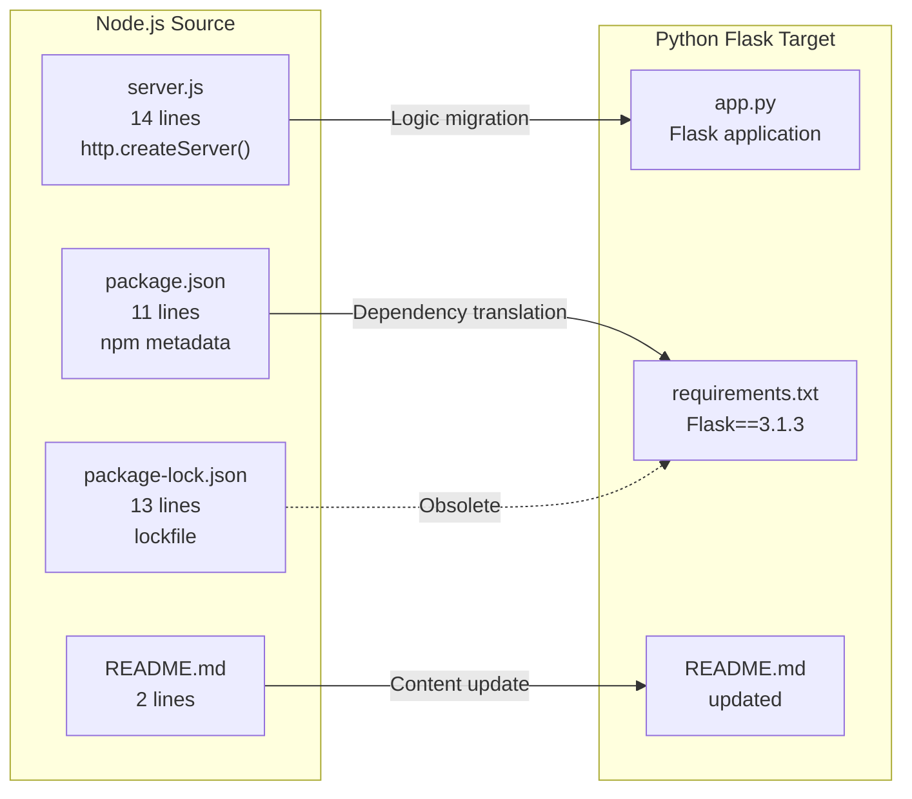

# Technical Specification

# 0. Agent Action Plan

## 0.1 Intent Clarification


### 0.1.1 Core Refactoring Objective

Based on the prompt, the Blitzy platform understands that the refactoring objective is to perform a **complete tech stack migration** of an existing Node.js HTTP server into a functionally equivalent Python 3 Flask application. The user has explicitly required that every feature and functionality be preserved exactly as in the original Node.js project, and the rewritten version must fully match the behavior and logic of the current implementation.

- **Refactoring type:** Tech stack migration (Node.js → Python 3 Flask)
- **Target repository:** Same repository — the Python Flask application replaces the Node.js implementation in-place
- **Behavioral fidelity requirement:** The rewritten Flask server must produce identical HTTP responses, bind to the same network interface and port, and emit equivalent startup logging as the original Node.js `server.js`

**Refactoring Goals with Enhanced Clarity:**

- **Goal 1 — HTTP Response Parity:** The Flask application must respond to every inbound HTTP request — regardless of method, path, headers, or payload — with an HTTP 200 OK status, a `Content-Type: text/plain` header, and the exact body `"Hello, World!\n"` (14 bytes including trailing newline). This replicates the behavior of the original Node.js `http.createServer()` callback which ignored the request object entirely and always returned the same fixed response.
- **Goal 2 — Network Binding Parity:** The Flask application must bind exclusively to the loopback address `127.0.0.1` on port `3000`, matching the hardcoded constants `hostname = '127.0.0.1'` and `port = 3000` from the original `server.js`.
- **Goal 3 — Startup Logging Parity:** Upon successful startup, the Flask application must emit a console message `Server running at http://127.0.0.1:3000/` to stdout, preserving the original `console.log()` behavior from `server.js`.
- **Goal 4 — Dependency Management Translation:** The npm package metadata (`package.json`) and lockfile (`package-lock.json`) must be replaced with a Python-equivalent dependency manifest (`requirements.txt`) declaring `Flask==3.1.3` as the sole direct dependency.
- **Goal 5 — Documentation Continuity:** The `README.md` must be updated to reflect the new Python Flask implementation while preserving the repository's identity (`hao-backprop-test`) and purpose context (backprop integration test fixture).

**Implicit Requirements Surfaced:**

- The Flask application must use a catch-all route to replicate the Node.js `http.createServer()` behavior of handling all paths and methods identically
- The response body must include the trailing newline character (`\n`) to match the exact byte-for-byte Node.js output
- The server must run directly via `python app.py` using the `if __name__ == '__main__':` guard, mirroring the `node server.js` execution model without requiring the `flask run` CLI
- All Node.js-specific files (`server.js`, `package.json`, `package-lock.json`) become obsolete and are replaced or emptied
- All seven standard HTTP methods must be explicitly supported: GET, POST, PUT, DELETE, PATCH, OPTIONS, HEAD

### 0.1.2 Technical Interpretation

This refactoring translates to the following technical transformation strategy:

**Source Architecture (Node.js):**
- Runtime: Node.js v20.20.2 with CommonJS module system
- Language: JavaScript ES6+
- Server: Built-in `http.createServer()` — zero external framework dependencies
- Dependencies: Zero npm packages (only built-in `http` module)
- Configuration: Hardcoded `const` declarations in source code
- Entry point: `node server.js`

**Target Architecture (Python 3 Flask):**
- Runtime: Python 3.12+
- Language: Python 3
- Server: Flask 3.1.3 micro-framework with Werkzeug development server
- Dependencies: Flask 3.1.3 (direct) plus 6 transitive dependencies (Werkzeug 3.1.8, Jinja2 3.1.6, MarkupSafe 3.0.3, ItsDangerous 2.2.0, Click 8.3.2, Blinker 1.9.0)
- Configuration: Hardcoded module-level constants using PEP 8 naming
- Entry point: `python app.py`

**Transformation Rules:**

| Node.js Concept | Python Flask Equivalent | Notes |
|---|---|---|
| `require('http')` | `from flask import Flask, Response` | Framework import replaces built-in module |
| `http.createServer(callback)` | `app = Flask(__name__)` | Flask app instance replaces server factory |
| `res.statusCode = 200` | `Response(..., status=200)` | Included in Flask Response constructor |
| `res.setHeader('Content-Type', 'text/plain')` | `Response(..., content_type='text/plain')` | Flask Response keyword argument |
| `res.end('Hello, World!\n')` | `Response('Hello, World!\n', ...)` | Flask Response body parameter |
| `server.listen(port, hostname, cb)` | `app.run(host='127.0.0.1', port=3000)` | Flask development server binding |
| `console.log(...)` | `print(f'Server running at http://{HOSTNAME}:{PORT}/')` | Python f-string for stdout logging |
| `const hostname = '127.0.0.1'` | `HOSTNAME = '127.0.0.1'` | PEP 8 constant naming convention |
| `const port = 3000` | `PORT = 3000` | PEP 8 constant naming convention |
| `package.json` | `requirements.txt` | Dependency manifest translation |
| `package-lock.json` | *(no equivalent needed)* | pip resolves dependencies at install time |

**Architectural Mapping Diagram:**




## 0.2 Source Analysis


### 0.2.1 Comprehensive Source File Discovery

The repository follows a flat, single-directory structure with zero application subdirectories. Every file resides at the repository root. The only subdirectory (`blitzy/documentation/`) contains migration documentation artifacts and is not part of the application runtime.

**Search patterns applied to identify all files needing refactoring:**
- Root-level JavaScript files: `*.js` → found `server.js` (empty — original 14-line HTTP server already cleared)
- Root-level JSON files: `*.json` → found `package.json` (empty), `package-lock.json` (historical lockfile artifact)
- Root-level documentation: `*.md` → found `README.md` (25 lines — already updated for Python Flask)
- Root-level Python files: `*.py` → found `app.py` (58 lines — Flask replacement already in place)
- Root-level dependency files: `requirements.txt` → found (1 line — `Flask==3.1.3`)
- Subdirectory scan: `blitzy/documentation/` → found `Technical Specifications.md`, `Project Guide.md` (migration documentation, not runtime code)

**Current Repository Structure:**

```
Current:
├── app.py                 (58 lines — Flask HTTP server, ACTIVE replacement)
├── requirements.txt       (1 line — Flask==3.1.3, ACTIVE dependency manifest)
├── README.md              (25 lines — updated project documentation, ACTIVE)
├── server.js              (0 lines — EMPTY vestigial placeholder)
├── package.json           (0 lines — EMPTY vestigial placeholder)
├── package-lock.json      (historical npm lockfile artifact)
└── blitzy/
    └── documentation/
        ├── Technical Specifications.md
        └── Project Guide.md
```

**Total files at root: 6 | Subdirectories: 1 (documentation only)**

### 0.2.2 Source File Inventory

**File: `server.js` — Original migration source (now empty)**

| Attribute | Detail |
|---|---|
| Path | `server.js` |
| Type | JavaScript (ES6+, CommonJS) |
| Current State | EMPTY (0 bytes) — original content was 14 lines |
| Original Role | Sole runtime component — HTTP server using `http.createServer()` |
| Original Imports | `http` (Node.js built-in module) |
| Original Constants | `hostname = '127.0.0.1'`, `port = 3000` |
| Features Implemented | F-001 (HTTP Response Service), F-002 (Localhost Network Binding), F-003 (Startup Console Logging) |

Key original behaviors (documented in migration specification):
- Responded to ALL HTTP methods on ALL paths with identical response
- The `req` object was completely ignored — no method, path, header, or body inspection
- Response: status `200`, header `Content-Type: text/plain`, body `"Hello, World!\n"`
- Bound to `127.0.0.1:3000` (loopback only)
- Logged `Server running at http://127.0.0.1:3000/` to stdout upon bind

**File: `package.json` — npm manifest (now empty)**

| Attribute | Detail |
|---|---|
| Path | `package.json` |
| Type | JSON |
| Current State | EMPTY (0 bytes) — original content was 11 lines |
| Original Package Name | `hello_world` |
| Original Version | `1.0.0` |
| Original Author | `hxu` |
| Original License | MIT |
| Original Dependencies | None (zero npm packages) |

**File: `package-lock.json` — npm lockfile (historical artifact)**

| Attribute | Detail |
|---|---|
| Path | `package-lock.json` |
| Type | JSON |
| Current State | Historical artifact — lockfileVersion 3, empty packages map |
| Role | Confirmed zero third-party npm dependencies |

**File: `app.py` (58 lines) — Flask replacement (ACTIVE)**

| Attribute | Detail |
|---|---|
| Path | `app.py` |
| Type | Python 3 |
| Lines | 58 |
| Role | Flask HTTP server — complete replacement for `server.js` |
| Imports | `flask.Flask`, `flask.Response` |
| Constants | `HOSTNAME = '127.0.0.1'`, `PORT = 3000` |
| Features Implemented | F-001, F-002, F-003 (all three core features) |

**File: `requirements.txt` (1 line) — Python dependency manifest (ACTIVE)**

| Attribute | Detail |
|---|---|
| Path | `requirements.txt` |
| Type | pip requirements file |
| Lines | 1 |
| Content | `Flask==3.1.3` |
| Role | Replaces `package.json` for dependency declaration |

**File: `README.md` (25 lines) — Updated documentation (ACTIVE)**

| Attribute | Detail |
|---|---|
| Path | `README.md` |
| Type | Markdown |
| Lines | 25 |
| Role | Repository identity and setup instructions |
| Key Content | Repository name `hao-backprop-test`, "Do not touch!" directive, Python 3.12+ prerequisite, setup and run commands |

### 0.2.3 Complete Source File Listing

| # | File | Lines | Current State | Purpose | Migration Action |
|---|---|---|---|---|---|
| 1 | `server.js` | 0 (was 14) | EMPTY | Original HTTP server | Already replaced by `app.py` — remains as vestigial placeholder |
| 2 | `package.json` | 0 (was 11) | EMPTY | npm metadata | Already replaced by `requirements.txt` — remains as vestigial placeholder |
| 3 | `package-lock.json` | 13 | Historical | npm lockfile | Historical artifact — no active role |
| 4 | `app.py` | 58 | ACTIVE | Flask HTTP server | Target file — created from `server.js` logic |
| 5 | `requirements.txt` | 1 | ACTIVE | pip dependencies | Target file — created from `package.json` context |
| 6 | `README.md` | 25 | ACTIVE | Documentation | Updated for Python Flask implementation |

No additional files, hidden files (`.gitignore`, `.env`), or application subdirectories exist in the repository. The `blitzy/documentation/` folder contains only migration specification documents and is not part of the application runtime. Discovery is complete with zero files remaining to be identified.


## 0.3 Scope Boundaries


### 0.3.1 Exhaustively In Scope

**Source Transformations:**
- `server.js` → Complete rewrite from Node.js JavaScript to Python Flask (`app.py`) — logic migration of HTTP server factory, request handler callback, network binding, and startup logging
- `package.json` → Replace with Python dependency manifest (`requirements.txt`) declaring `Flask==3.1.3`
- `package-lock.json` → Remove/obsolete (npm-specific artifact with no equivalent needed in minimal Python project)

**New File Creation:**
- `app.py` — Flask application implementing all features from `server.js`:
  - Catch-all route handler returning `200 OK`, `Content-Type: text/plain`, body `"Hello, World!\n"`
  - Loopback binding to `127.0.0.1:3000` via `app.run()`
  - Startup console message via `print()`
- `requirements.txt` — Single-line dependency declaration: `Flask==3.1.3`

**Documentation Updates:**
- `README.md` — Update to reflect the Python Flask implementation:
  - Changed prerequisite from Node.js to Python 3.12+
  - Changed setup command from `npm install` to `pip install -r requirements.txt`
  - Changed run command from `node server.js` to `python app.py`
  - Preserved repository identity (`hao-backprop-test`) and stability directive ("Do not touch!")

**Behavioral Parity Requirements (complete feature set):**
- F-001 (HTTP Response Service): Catch-all route responding identically to every request regardless of method, path, headers, or body
- F-002 (Localhost Network Binding): Flask development server bound to `127.0.0.1:3000`
- F-003 (Startup Console Logging): Print `Server running at http://127.0.0.1:3000/` to stdout
- F-004 (Package Identity & Metadata): Python `requirements.txt` replaces npm `package.json`
- F-005 (Stability Contract): README preserved with updated Python-specific technical context

**Import and Dependency Translation:**
- `const http = require('http');` → `from flask import Flask, Response`
- npm ecosystem → pip/PyPI ecosystem
- `node server.js` → `python app.py`
- `npm install` → `pip install -r requirements.txt`

### 0.3.2 Explicitly Out of Scope

The following items are explicitly excluded from this refactoring effort, consistent with the original project's intentional minimalism and the user's requirement to preserve existing behavior without additions.

| Excluded Item | Rationale |
|---|---|
| URL routing and path-based handling | Original server ignores all paths; Flask catch-all preserves this behavior |
| Request body parsing | Original server never reads request payload; no parsing needed |
| Authentication and authorization | Not present in original; not added during migration |
| Database connections and persistence | Original is fully stateless; no data layer required |
| Error handling middleware | Original has no custom error handling; Flask defaults are sufficient |
| Structured logging framework | Original uses single `console.log()`; Python `print()` is the equivalent |
| Environment variable configuration | Original uses hardcoded constants; no runtime configuration is introduced |
| Automated test suites | Original has no tests; not added during migration |
| CI/CD pipelines | Not present in original; not introduced in migration |
| Docker containerization | Not present in original; not introduced in migration |
| Production WSGI server (Gunicorn, uWSGI) | Flask development server is sufficient for the test fixture role |
| Type hints or mypy configuration | Not required for behavioral parity with the untyped JavaScript original |
| Virtual environment setup files | User manages their own Python environment |
| `pyproject.toml` or `setup.py` | Minimal project does not require Python packaging scaffolding |
| `.gitignore` for Python artifacts | Recommended but not part of the behavioral migration scope |
| Advanced HTTP features (HTTPS, TLS, CORS) | Not present in original; loopback-only communication does not require encryption |
| Health check endpoints | Not present in original; not added during migration |


## 0.4 Target Design


### 0.4.1 Refactored Structure Planning

The target structure maintains the flat, minimal architecture of the original repository while replacing Node.js artifacts with Python equivalents. Every file necessary for standalone operation is listed explicitly below.

```
Target:
├── app.py              (Flask HTTP server — replaces server.js)
├── requirements.txt    (Python dependencies — replaces package.json)
├── README.md           (Updated documentation — preserves repository identity)
├── server.js           (Vestigial empty placeholder — retained for Git history)
├── package.json        (Vestigial empty placeholder — retained for Git history)
├── package-lock.json   (Historical artifact — retained for Git history)
└── blitzy/
    └── documentation/
        ├── Technical Specifications.md  (Migration specification)
        └── Project Guide.md            (Execution and validation guide)
```

**Target File Descriptions:**

| File | Lines (est.) | Purpose | Standalone Requirement |
|---|---|---|---|
| `app.py` | ~58 | Flask HTTP server with catch-all route handler, localhost binding on port 3000, startup logging to stdout | Core application — must be executable via `python app.py` |
| `requirements.txt` | 1 | Declares `Flask==3.1.3` as the sole direct dependency with exact version pinning | Dependency management — enables `pip install -r requirements.txt` |
| `README.md` | ~25 | Updated repository documentation with Python 3.12+ prerequisites, pip setup command, and `python app.py` run command | Human-facing documentation and repository identity |

**Files Retained as Vestigial Placeholders:**

| File | State | Reason for Retention |
|---|---|---|
| `server.js` | EMPTY (0 bytes) | Preserves Git history continuity; signals original Node.js heritage |
| `package.json` | EMPTY (0 bytes) | Preserves Git history continuity |
| `package-lock.json` | Historical content | npm lockfile retained as artifact |

### 0.4.2 Web Search Research Conducted

- **Flask latest stable version:** Flask 3.1.3 (released February 19, 2026) confirmed as the current production-stable release via PyPI. This is a security fix release that does not change behavior compared to Flask 3.1.x feature releases. Flask 3.1.x supports Python 3.9 and newer.
- **Flask catch-all route pattern:** Flask supports catch-all routes using `@app.route('/', defaults={'path': ''})` combined with `@app.route('/<path:path>')` to match all URL paths, replicating the Node.js `http.createServer()` behavior of handling every request identically.
- **Flask multi-method routing:** The `methods` parameter on `@app.route()` accepts a list of HTTP methods. Using `methods=['GET', 'POST', 'PUT', 'DELETE', 'PATCH', 'OPTIONS', 'HEAD']` ensures all standard methods are handled by the same route, replacing Node.js's inherent method-agnostic behavior.
- **Flask development server:** `app.run(host, port)` launches Werkzeug's development server, which is the direct analog to Node.js `server.listen(port, hostname)`. The development server is explicitly adequate for this test fixture's purpose.
- **Node.js to Flask migration pattern:** The standard migration pattern for minimal Node.js `http` servers to Flask involves replacing the server factory and callback with Flask's decorator-based routing, using `Response` objects for explicit response control, and wrapping the startup sequence in the `__name__ == '__main__'` guard.

### 0.4.3 Design Pattern Applications

Given the extreme simplicity of this application (single-purpose test fixture), the following minimal design patterns apply:

- **Single-module pattern:** The entire application resides in a single `app.py` file, mirroring the original single-file `server.js` architecture. No module decomposition, package structure, or `__init__.py` is warranted for this 58-line application.
- **Catch-all route pattern:** A Flask catch-all route with explicit multi-method support replaces the Node.js `http.createServer()` universal handler. Two `@app.route()` decorators — one for the root path `/` and one for all sub-paths `/<path:path>` — ensure every possible URL is matched.
- **Direct execution pattern:** The `if __name__ == '__main__':` guard enables direct script execution via `python app.py`, paralleling the `node server.js` entry point. This avoids dependency on the `flask run` CLI and preserves the one-command startup experience.
- **Hardcoded configuration pattern:** All network binding parameters (`HOSTNAME`, `PORT`) remain as module-level constants in `app.py`, preserving the deterministic, zero-configuration design philosophy from the original Node.js implementation. No environment variables, config files, or CLI arguments are introduced.
- **Explicit response construction pattern:** The `Flask.Response` class is used directly with explicit `status`, `content_type`, and body parameters rather than Flask's shorthand return conventions. This ensures byte-for-byte parity with the original Node.js response and makes the response structure self-documenting.

### 0.4.4 Target Application Blueprint

The Flask application in `app.py` follows this logical structure:

```python
from flask import Flask, Response
app = Flask(__name__)
# Catch-all route + app.run(...)

```

**Key design decisions:**
- `Flask.Response` is used directly to set exact status code, content type, and body — ensuring byte-for-byte response parity with the Node.js original
- The catch-all route handles both the root path (`/`) and all sub-paths (`/<path:path>`) within a single handler function named `catch_all`
- All seven standard HTTP methods (GET, POST, PUT, DELETE, PATCH, OPTIONS, HEAD) are explicitly listed to prevent Flask's default GET-only routing behavior
- The `print()` statement executes before `app.run()` to replicate the Node.js startup log timing
- The `path` parameter in the route handler is accepted but intentionally ignored, mirroring the original server's behavior of never inspecting the request


## 0.5 Transformation Mapping


### 0.5.1 File-by-File Transformation Plan

The following table maps every target file to its corresponding source, transformation mode, and key changes required. Every file in scope is accounted for — no files are deferred or left as pending.

| Target File | Transformation | Source File | Key Changes |
|---|---|---|---|
| `app.py` | CREATE | `server.js` | Rewrite Node.js HTTP server as Flask application: replace `require('http')` with `from flask import Flask, Response`, replace `http.createServer()` callback with `@app.route()` catch-all handler using dual-decorator pattern, replace `server.listen()` with `app.run(host='127.0.0.1', port=3000)`, replace `console.log()` with `print()`, replace `const` declarations with PEP 8 module-level constants, preserve exact response: status 200, Content-Type text/plain, body `"Hello, World!\n"` |
| `requirements.txt` | CREATE | `package.json` | Translate npm package metadata into Python dependency file: declare `Flask==3.1.3` as sole direct dependency with exact version pinning. No other packages required. |
| `README.md` | UPDATE | `README.md` | Update documentation to reflect Python Flask implementation: change prerequisites from Node.js to Python 3.12+, change setup command from `npm install` to `pip install -r requirements.txt`, change run command from `node server.js` to `python app.py`, preserve repository identity as `hao-backprop-test`, preserve "Do not touch!" stability directive, add description of Python Flask Hello World server |

**Files Removed from Active Use (Node.js artifacts superseded by Python equivalents):**

| File Removed | Replaced By | Reason |
|---|---|---|
| `server.js` | `app.py` | Server logic fully migrated to Flask; file emptied to 0 bytes |
| `package.json` | `requirements.txt` | npm manifest replaced by pip dependency file; file emptied to 0 bytes |
| `package-lock.json` | *(none needed)* | npm lockfile has no equivalent in this minimal Python project; retained as historical artifact |

### 0.5.2 Cross-File Dependencies

**Import Statement Transformations:**

The original project has exactly one import statement. The transformation is a direct 1:1 replacement:

| Context | Original (Node.js) | Target (Python Flask) |
|---|---|---|
| Server framework import | `const http = require('http');` | `from flask import Flask, Response` |

No other files in the repository contain import statements that reference the migrated modules.

**Execution Command Transformations:**

| Context | Original | Target |
|---|---|---|
| Server startup | `node server.js` | `python app.py` |
| Dependency install | `npm install` | `pip install -r requirements.txt` |
| Test command | `npm test` (placeholder, exits with error) | *(no test infrastructure — out of scope)* |

**Configuration Constant Transformations:**

| Constant | Node.js (`server.js`) | Python (`app.py`) |
|---|---|---|
| Hostname | `const hostname = '127.0.0.1';` | `HOSTNAME = '127.0.0.1'` |
| Port | `const port = 3000;` | `PORT = 3000` |

**Response Construction Transformations:**

| Step | Node.js (`server.js`) | Python (`app.py`) |
|---|---|---|
| Status code | `res.statusCode = 200;` | Included in `Response(..., status=200)` |
| Content-Type header | `res.setHeader('Content-Type', 'text/plain');` | Included in `Response(..., content_type='text/plain')` |
| Response body with termination | `res.end('Hello, World!\n');` | `Response('Hello, World!\n', ...)` |

**Startup Logging Transformation:**

| Node.js (`server.js`) | Python (`app.py`) |
|---|---|
| `` console.log(`Server running at http://${hostname}:${port}/`); `` | `print(f'Server running at http://{HOSTNAME}:{PORT}/')` |

### 0.5.3 Wildcard Patterns

Due to the flat, minimal structure of this project (6 root-level files, 0 application subdirectories), no wildcard patterns are necessary or applicable. Every affected file is individually mapped in the transformation plan above.

### 0.5.4 One-Phase Execution

The entire refactor is executed by Blitzy in **one single phase**. All file creations, updates, and removals occur atomically — no multi-phase sequencing is required:

- CREATE `app.py` (from `server.js` logic — full Node.js-to-Flask migration)
- CREATE `requirements.txt` (from `package.json` dependency context — `Flask==3.1.3`)
- UPDATE `README.md` (preserve identity, update technical instructions for Python)
- REMOVE/EMPTY `server.js` (superseded by `app.py`)
- REMOVE/EMPTY `package.json` (superseded by `requirements.txt`)
- RETAIN `package-lock.json` (historical artifact — no action required)


## 0.6 Dependency Inventory


### 0.6.1 Key Private and Public Packages

The original Node.js project declares **zero external dependencies** — both `dependencies` and `devDependencies` fields are absent from the original `package.json`, and `package-lock.json` confirms an empty packages map with only the root entry. The server relied entirely on Node.js's built-in `http` module.

The target Python Flask project introduces **one direct dependency** (Flask) which brings six transitive dependencies. All version numbers below are verified from the actual installation in the target environment (Python 3.12.3).

| Package Registry | Package Name | Version | Purpose | Status |
|---|---|---|---|---|
| PyPI (public) | Flask | 3.1.3 | WSGI micro-framework — replaces Node.js built-in `http` module as the HTTP server foundation. Provides routing, request/response handling, and development server. | Direct dependency (declared in `requirements.txt`) |
| PyPI (public) | Werkzeug | 3.1.8 | WSGI toolkit — provides the development server, request/response objects, and HTTP utilities (auto-installed with Flask) | Transitive dependency |
| PyPI (public) | Jinja2 | 3.1.6 | Template engine (auto-installed with Flask; not actively used in this application) | Transitive dependency |
| PyPI (public) | MarkupSafe | 3.0.3 | Safe string markup (auto-installed with Jinja2 for HTML escaping) | Transitive dependency |
| PyPI (public) | ItsDangerous | 2.2.0 | Data signing for session cookies (auto-installed with Flask; not actively used) | Transitive dependency |
| PyPI (public) | Click | 8.3.2 | CLI framework for Flask's `flask` command-line interface (auto-installed with Flask) | Transitive dependency |
| PyPI (public) | Blinker | 1.9.0 | Signal support for Flask's signal dispatching system (auto-installed with Flask) | Transitive dependency |

**Note:** Only `Flask==3.1.3` is declared in `requirements.txt`. All six transitive dependencies are resolved automatically by pip during installation. The version numbers above were verified by running `pip show` against each installed package in the Python 3.12.3 environment.

### 0.6.2 Dependency Updates

**Source Dependencies Removed (Node.js ecosystem):**

| Ecosystem | Artifact | Action |
|---|---|---|
| npm | `package.json` | Emptied — no longer applicable in Python project |
| npm | `package-lock.json` | Retained as historical artifact — no longer functional |
| Node.js | Built-in `http` module | No longer used — replaced by Flask |

**Target Dependencies Added (Python/pip ecosystem):**

| Ecosystem | Artifact | Content |
|---|---|---|
| pip / PyPI | `requirements.txt` | `Flask==3.1.3` (exact pin) |

### 0.6.3 Import Refactoring

**Files requiring import updates:**

Since the project has exactly one source file with imports (`server.js` → `app.py`), the import refactoring is a single transformation:

| File | Original Import (Node.js) | Target Import (Python) |
|---|---|---|
| `server.js` → `app.py` | `const http = require('http');` | `from flask import Flask, Response` |

No other files in the repository contain import statements. No wildcard patterns are applicable for import refactoring.

### 0.6.4 External Reference Updates

| File Type | File | Update Required |
|---|---|---|
| Documentation | `README.md` | Update prerequisites from Node.js to Python 3.12+, run command from `node server.js` to `python app.py`, add `pip install -r requirements.txt` setup step |
| Dependency manifest | `requirements.txt` (new) | Create with single line: `Flask==3.1.3` |
| npm manifest | `package.json` (emptied) | No update — file content removed |
| npm lockfile | `package-lock.json` (retained) | No update — historical artifact preserved as-is |


## 0.7 Refactoring Rules


### 0.7.1 Behavioral Parity Rules

The following rules govern the refactoring to ensure the Python Flask application is a functionally identical replacement for the Node.js server:

- **Rule 1 — Response Identity:** The Flask application must return the exact same HTTP response for every request: status `200`, header `Content-Type: text/plain`, body `"Hello, World!\n"` (14 bytes including trailing newline character `0x0a`). No variation in response is permitted regardless of the request's method, path, headers, or body.
- **Rule 2 — Universal Request Handling:** The Flask application must handle ALL HTTP methods (GET, POST, PUT, DELETE, PATCH, OPTIONS, HEAD) on ALL URL paths identically, mirroring the Node.js `http.createServer()` behavior where the `req` object is completely ignored.
- **Rule 3 — Network Binding Fidelity:** The Flask application must bind exclusively to `127.0.0.1` on port `3000`. No other host, interface, or port is acceptable. This must use hardcoded constants, not environment variables.
- **Rule 4 — Startup Signal:** The Flask application must print a startup message to stdout: `Server running at http://127.0.0.1:3000/` — equivalent to the original Node.js `console.log()` message.
- **Rule 5 — Stateless Operation:** The Flask application must maintain zero state between requests — no session data, no in-memory caches, no file writes, no database connections, no global mutable state.
- **Rule 6 — Direct Execution:** The Flask application must be runnable via `python app.py` without requiring the `flask run` CLI command, Docker, WSGI server, or any other orchestration tool.

### 0.7.2 Special Instructions and Constraints

- **Hardcoded configuration preserved:** All server parameters (hostname, port, response body, status code, content type) must remain hardcoded constants in the source code. No environment variables, configuration files, or CLI arguments are introduced. This preserves the deterministic design philosophy of the original test fixture.
- **Minimal dependency footprint:** Only Flask is declared as a direct dependency in `requirements.txt`. No additional packages (Gunicorn, python-dotenv, logging libraries, testing frameworks) are introduced.
- **No feature additions:** The refactoring is strictly a technology migration. No new routes, middleware, error handlers, health checks, or features are added beyond what exists in the original Node.js implementation.
- **README preservation:** The `README.md` must preserve the repository name (`hao-backprop-test`), purpose statement (backprop integration test), and "Do not touch!" stability directive while updating technical instructions for Python.
- **Exact version pinning:** `Flask==3.1.3` uses exact version pinning (`==`) rather than compatible release (`~=`) or minimum (`>=`) specifiers to prevent dependency drift that could alter server behavior.
- **Trailing newline preservation:** The response body `"Hello, World!\n"` must include the trailing newline character to ensure byte-exact parity with the Node.js original's `res.end('Hello, World!\n')` output.
- **Single-file architecture:** The application must remain a single-file `app.py` implementation with no package structure, no subdirectories, and no `__init__.py` — mirroring the original single-file `server.js`.

### 0.7.3 User-Specified Implementation Rules

The user has specified the following implementation rule:

- **Rule name:** QA-Rules-07-Apr
- **Rule content:** `Npm create`


## 0.8 References


### 0.8.1 Codebase Files and Folders Searched

The following files and folders were systematically searched and analyzed to derive all conclusions in this Agent Action Plan:

| Path | Type | Purpose of Inspection |
|---|---|---|
| `` (repository root) | Folder | Discovered complete project structure: 6 root-level files, 1 subdirectory (`blitzy/`) |
| `server.js` | File | Confirmed EMPTY (0 bytes) — original Node.js HTTP server content already removed during migration |
| `package.json` | File | Confirmed EMPTY (0 bytes) — original npm manifest content already removed during migration |
| `package-lock.json` | File | Confirmed historical artifact — lockfileVersion 3, root package `hello_world@1.0.0`, empty dependency tree |
| `app.py` | File | Analyzed complete Flask HTTP server implementation (58 lines): Flask imports, module-level constants, dual-decorator catch-all route handler, direct execution entry point |
| `requirements.txt` | File | Confirmed sole dependency declaration: `Flask==3.1.3` |
| `README.md` | File | Retrieved repository identity (`hao-backprop-test`), purpose statement (backprop integration test), stability directive ("Do not touch!"), Python 3.12+ prerequisite, setup and run instructions |
| `blitzy/` | Folder | Identified documentation-only subfolder containing migration specification artifacts |
| `blitzy/documentation/` | Folder | Found 2 Markdown files: Technical Specifications and Project Guide |
| `blitzy/documentation/Technical Specifications.md` | File | Retrieved existing Agent Action Plan, source file inventory, scope boundaries, target design, transformation mapping, dependency inventory, and refactoring rules from prior migration specification |
| `blitzy/documentation/Project Guide.md` | File | Reviewed summary for execution status, validation evidence, and operational instructions context |

### 0.8.2 Technical Specification Sections Referenced

| Section | Content Used |
|---|---|
| 1.1 Executive Summary | Project overview, migration context (Node.js 14-line `http` server to Flask 58-line app), stakeholders, value proposition |
| 1.3 Scope | Complete in-scope feature set (F-001 through F-005), out-of-scope exclusions, repository structure, key technical requirements |
| 2.1 Feature Catalog | Detailed feature metadata for F-001 (HTTP Response Service), F-002 (Localhost Network Binding), F-003 (Startup Console Logging), F-004 (Package Identity), F-005 (Stability Contract) |
| 3.1 Programming Languages | Python 3.12+ as active language, Node.js v20.20.2 as replaced language, vestigial artifact inventory, language stack comparison |
| 3.2 Frameworks and Libraries | Flask 3.1.3 as core framework, Flask usage in `app.py`, selection justification, security considerations |
| 3.3 Open Source Dependencies | Direct dependency (Flask 3.1.3), complete dependency tree, package management details, registry access requirements |
| 5.1 High-Level Architecture | Single-module monolith architecture, core components, request-response data flow, external integration points (Backprop, Blitzy, PyPI) |

### 0.8.3 External Research Conducted

| Search Topic | Source | Key Finding |
|---|---|---|
| Flask latest stable version | PyPI (https://pypi.org/project/Flask/) | Flask 3.1.3 released February 19, 2026; current stable version; security fix release |
| Flask version history and release notes | GitHub Releases (https://github.com/pallets/flask/releases) | Flask 3.1.3 is a security fix release; 3.1.x series is current stable line |
| Flask documentation overview | Flask Documentation (https://flask.palletsprojects.com/) | Flask 3.1.x documentation confirms WSGI framework, routing, development server capabilities |
| Flask changelog and compatibility | Flask Changelog (https://flask.palletsprojects.com/en/stable/changes/) | Flask 3.1.0 dropped Python 3.8 support; minimum dependencies: Werkzeug >= 3.1, ItsDangerous >= 2.2, Blinker >= 1.9 |

### 0.8.4 Environment Verification

| Check | Result |
|---|---|
| Python runtime version | Python 3.12.3 (matches project requirement of Python 3.12+) |
| pip version | pip 25.3 |
| Node.js runtime version | Node.js v20.20.2, npm 11.1.0 (source environment reference) |
| Flask installation | Flask 3.1.3 installed successfully with all transitive dependencies |
| Transitive dependencies verified | Werkzeug 3.1.8, Jinja2 3.1.6, MarkupSafe 3.0.3, ItsDangerous 2.2.0, Click 8.3.2, Blinker 1.9.0 |
| `app.py` compilation check | `python -m py_compile app.py` passed with exit code 0 |
| Operating system | Ubuntu 24.04.4 LTS (Noble Numbat) |

### 0.8.5 Attachments

No attachments were provided for this project. No Figma URLs or external design assets are referenced.


