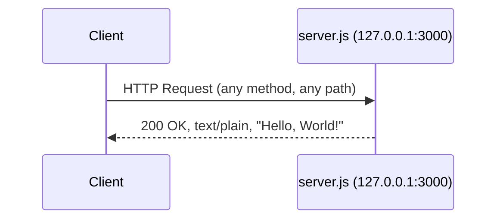
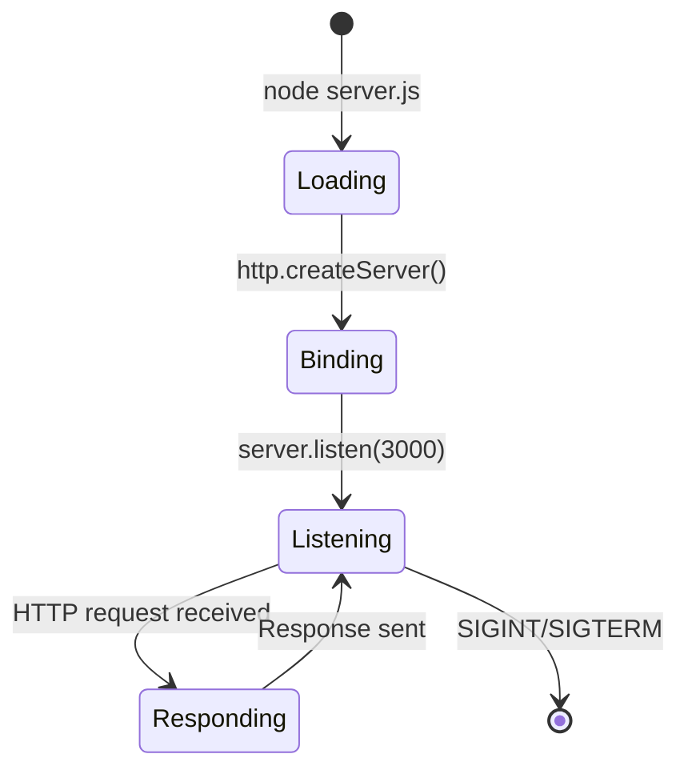

# Technical Specification

# 0. Agent Action Plan

## 0.1 Intent Clarification


### 0.1.1 Core Documentation Objective

Based on the provided requirements, the Blitzy platform understands that the documentation objective is to **create comprehensive documentation and inline code annotations** for the `hao-backprop-test` repository — a minimal Node.js HTTP server project. The request encompasses two distinct documentation dimensions: source-level JSDoc annotations within `server.js` and project-level Markdown documentation in a fully rewritten `README.md`.

**Request Category:** Create new documentation | Update existing documentation

**Documentation Types:**
- **API Documentation** — JSDoc comments covering all functions, constants, and the HTTP server module in `server.js`
- **README / User Guide** — A comprehensive `README.md` with setup instructions, API reference, deployment guide, and project overview
- **Inline Code Explanations** — Descriptive comments within `server.js` explaining the logic and purpose of each code block

**Requirement Breakdown:**

- **R-001: JSDoc Comments for `server.js`** — Add standards-compliant JSDoc block comments (`/** ... */`) to all functions, callbacks, constants, and the module declaration in `server.js`. This includes the `http.createServer` request handler callback and the `server.listen` startup callback.
- **R-002: Comprehensive README** — Replace the existing 2-line `README.md` with a full-featured project README containing structured sections for project overview, prerequisites, installation, usage, API reference, deployment, and project structure.
- **R-003: Setup Instructions** — Document the steps to install prerequisites (Node.js), clone the repository, install dependencies, and start the server.
- **R-004: API Documentation** — Detail the HTTP endpoint exposed by `server.js`, including the URL, supported methods, response format, status codes, and content type.
- **R-005: Deployment Guide** — Provide guidance on running the server in different environments, including local development, production considerations, and process management.
- **R-006: Inline Code Explanations** — Add line-level or block-level comments in `server.js` that explain the purpose and mechanics of each code section for developers unfamiliar with the codebase.

### 0.1.2 Special Instructions and Constraints

- **Repository Nature:** The repository is an integration test fixture for the "backprop" system. The `README.md` currently states: *"test project for backprop integration. Do not touch!"* — this directive applies to the repository's role as a test target, but the user's explicit documentation request supersedes this for the purpose of adding documentation.
- **Zero-Dependency Environment:** The project has zero `dependencies` and zero `devDependencies` in `package.json`. JSDoc will be used as a development tool for documentation generation but is not required at runtime.
- **Flat File Structure:** All 14 files reside at the repository root with no subdirectories. Documentation additions must respect this flat structure or introduce minimal directory hierarchy only where necessary.
- **Single Executable Component:** Only `server.js` contains executable code. All other files (CSV, Java stubs, empty placeholders) are static fixtures and do not require JSDoc or inline code documentation.
- **Style Preferences:** Documentation should be clear, technically accurate, and accessible to developers at all experience levels. JSDoc comments should follow the JSDoc 4.x tag specification. The README should use standard Markdown formatting with proper headers, code blocks, and tables.

### 0.1.3 Technical Interpretation

These documentation requirements translate to the following technical documentation strategy:

- To **document the server module**, we will add a JSDoc `@module` block at the top of `server.js` describing the HTTP server's purpose, binding configuration, and response behavior.
- To **document server constants**, we will add JSDoc `@const` annotations to the `hostname`, `port`, and `server` constant declarations with `@type` tags specifying their data types.
- To **document the request handler**, we will add a JSDoc comment to the `http.createServer` callback describing parameters (`req`, `res`), the response behavior, and content type using `@param` and `@returns` tags.
- To **document the listen callback**, we will add a JSDoc comment to the `server.listen` callback describing the startup log output.
- To **provide inline explanations**, we will add single-line (`//`) comments above or beside each logical code block in `server.js` explaining its function.
- To **create the comprehensive README**, we will rewrite `README.md` with structured sections covering project identity, prerequisites, installation, usage, API reference, deployment, project structure, license, and contributing guidelines.

### 0.1.4 Inferred Documentation Needs

Based on code and repository analysis, the following implicit documentation needs have been identified:

- **Project Structure Documentation:** The repository contains 14 files across four categories (runtime server, language stubs, reference data, filesystem fixtures). The README should include a project structure section explaining each file's purpose.
- **Prerequisite Documentation:** `server.js` requires Node.js v6+ (compatible up to v20.x). This runtime prerequisite must be documented in the setup instructions.
- **Port Configuration Documentation:** The server binds to `127.0.0.1:3000` with hardcoded values. The README should document this and note the `EADDRINUSE` error if port 3000 is occupied.
- **Response Contract Documentation:** The server returns `200 OK` with `Content-Type: text/plain` and body `Hello, World!\n` for all HTTP methods and paths. This invariant response contract should be documented as the API specification.
- **Limitation Documentation:** The server has no routing, no error handling, no HTTPS, and no middleware. These limitations should be documented to set correct expectations.
- **JSDoc Configuration:** A `jsdoc.json` configuration file should be created to enable reproducible documentation generation from the annotated source.


## 0.2 Documentation Discovery and Analysis


### 0.2.1 Existing Documentation Infrastructure Assessment

Repository analysis reveals a **minimal documentation footprint** with a single 2-line `README.md` and zero documentation infrastructure. No documentation generators, style guides, or API documentation tools are present.

**Documentation Files Found:**

| File | Type | Size | Content | Status |
|------|------|------|---------|--------|
| `README.md` | Project README | 73 bytes, 2 lines | Title "hao-backprop-test" and directive "test project for backprop integration. Do not touch!" | Exists — requires complete rewrite |

**Documentation Infrastructure — Confirmed Absent:**

| Infrastructure Component | Status | Evidence |
|--------------------------|--------|----------|
| Documentation generator (MkDocs, Docusaurus, Sphinx) | **Not present** | No `mkdocs.yml`, `docusaurus.config.js`, or `conf.py` found at repository root |
| JSDoc configuration | **Not present** | No `.jsdoc.json`, `jsdoc.json`, or `jsdoc.config.js` found |
| API documentation tools | **Not present** | No Swagger/OpenAPI specs, no Postman collections |
| Diagram tools | **Not present** | No Mermaid CLI config, no PlantUML setup |
| Documentation hosting | **Not present** | No `.readthedocs.yml`, no GitHub Pages config |
| Inline code comments | **Not present** | `server.js` contains zero comments of any kind |
| JSDoc annotations | **Not present** | `server.js` contains zero `/** ... */` doc blocks |

**Current Documentation Framework:** None — the project has no documentation generation pipeline.

### 0.2.2 Repository Code Analysis for Documentation

**Search patterns used to identify code requiring documentation:**

- `server.js` — Primary executable containing 4 `const` declarations, 1 `http.createServer` call with an arrow-function callback, and 1 `server.listen` call with an arrow-function callback
- `package.json` — npm package metadata declaring the project as `hello_world` v1.0.0 with zero dependencies
- `server - Copy.js` — Byte-identical duplicate of `server.js`; documentation effort should target only the original

**Key directories examined:** Repository root (flat structure, zero subdirectories)

**Code elements in `server.js` requiring JSDoc documentation:**

| Line(s) | Element | Type | Current Documentation |
|----------|---------|------|-----------------------|
| 1 | `const http = require('http')` | Module import | None |
| 3 | `const hostname = '127.0.0.1'` | Constant | None |
| 4 | `const port = 3000` | Constant | None |
| 6–10 | `http.createServer((req, res) => {...})` | Server factory + request handler callback | None |
| 12–14 | `server.listen(port, hostname, () => {...})` | Server startup with callback | None |
| (top) | Module-level description | Module declaration | None |

**Related documentation found:** The existing `README.md` provides only a project title and a stability warning — no technical content, no setup guide, no API reference.

### 0.2.3 Web Search Research Conducted

- **JSDoc version and compatibility:** JSDoc 4.0.5 (latest stable as of 2025) confirmed compatible with Node.js 12.0.0+. The project runs on Node.js v20.20.1, which is fully supported. JSDoc is installed as a development dependency via `npm install --save-dev jsdoc@4.0.5`.
- **JSDoc best practices for Node.js HTTP servers:** Standard tags include `@module` for module description, `@const` for constants, `@param` for function parameters, `@type` for type annotations, `@callback` for callback documentation, and `@listens` for event bindings.
- **README best practices for Node.js projects:** Standard sections include: project title with badges, description, prerequisites, installation, usage, API reference, deployment, project structure, contributing, and license.
- **Documentation structure conventions:** For small single-file Node.js projects, documentation is best served by comprehensive JSDoc inline comments combined with a thorough README rather than a full documentation site generator.


## 0.3 Documentation Scope Analysis


### 0.3.1 Code-to-Documentation Mapping

**Module requiring documentation:**

- **Module: `server.js`** (14 lines, sole executable component)
  - Public APIs / Documentable Elements:
    - Module-level `@module` declaration describing the HTTP server
    - `hostname` constant (`'127.0.0.1'`) — `@const {string}`
    - `port` constant (`3000`) — `@const {number}`
    - `server` constant (return value of `http.createServer`) — `@const {http.Server}`
    - Request handler callback `(req, res) => {...}` — `@callback` with `@param {http.IncomingMessage} req` and `@param {http.ServerResponse} res`
    - Listen callback `() => {...}` — startup logging callback
  - Current documentation: **Completely missing** — zero JSDoc blocks, zero inline comments
  - Documentation needed: Full JSDoc annotations, inline explanatory comments

- **Module: `package.json`** (npm package metadata)
  - Documentable elements: Package name (`hello_world`), version (`1.0.0`), entry point (`index.js`), test script, author, license
  - Current documentation: Self-documenting JSON structure
  - Documentation needed: Explained in README project overview — no changes to file itself

**Configuration options requiring documentation:**

| Configuration | File | Value | Currently Documented | Documentation Target |
|---------------|------|-------|----------------------|----------------------|
| Server hostname | `server.js` line 3 | `127.0.0.1` | No | JSDoc `@const` + README API section |
| Server port | `server.js` line 4 | `3000` | No | JSDoc `@const` + README API section |
| Response status code | `server.js` line 7 | `200` | No | JSDoc callback docs + README API section |
| Response content type | `server.js` line 8 | `text/plain` | No | JSDoc callback docs + README API section |
| Response body | `server.js` line 9 | `Hello, World!\n` | No | JSDoc callback docs + README API section |
| npm package name | `package.json` | `hello_world` | In file only | README project overview |
| npm package version | `package.json` | `1.0.0` | In file only | README project overview |
| npm entry point | `package.json` | `index.js` (absent) | No | README known issues/notes |

**Features requiring user guides (README sections):**

| Feature | Current Coverage | Gaps |
|---------|-----------------|------|
| Server startup and usage | None | Full setup, installation, and run instructions |
| HTTP endpoint behavior | None | API reference with methods, responses, and examples |
| Deployment | None | Local and production deployment guidance |
| Project structure | None | File listing with descriptions |
| Error scenarios | None | Port conflict (`EADDRINUSE`), troubleshooting |

### 0.3.2 Documentation Gap Analysis

Given the requirements and repository analysis, documentation gaps include:

**Undocumented public APIs and code elements:**
- `server.js` — All 14 lines lack any form of documentation (JSDoc or inline comments). There are 4 constants, 1 server creation call, and 1 listen invocation, totaling 6 documentable code elements with 0% current coverage.

**Missing user guides:**
- No setup or installation guide exists for new developers
- No API reference documents the HTTP endpoint contract
- No deployment guide explains how to run the server
- No project structure overview explains the 14-file composition
- No troubleshooting section addresses common issues (port conflicts, Node.js version requirements)

**Missing project metadata documentation:**
- No prerequisites section listing Node.js version requirements
- No license explanation despite MIT license declared in `package.json`
- No contributing guidelines

**Incomplete architecture documentation:**
- The server's request/response flow is undocumented
- The relationship between `server.js` and `server - Copy.js` (byte-identical duplicate) is unexplained
- The purpose of fixture files (CSV, Java stubs, empty files) is not documented for project visitors

**Outdated documentation:**
- `README.md` currently contains only a project title and a stability directive with no technical content — this requires a complete rewrite rather than an incremental update


## 0.4 Documentation Implementation Design


### 0.4.1 Documentation Structure Planning

The documentation for this project follows a two-tier approach: source-level JSDoc annotations within `server.js` and a comprehensive `README.md` at the repository root. Given the project's flat structure and single-file executable, a full documentation site generator (MkDocs, Docusaurus) is unnecessary — the README and JSDoc combination provides complete coverage.

**Documentation hierarchy:**

```
/ (repository root)
├── README.md              (comprehensive project documentation — REWRITE)
├── server.js              (JSDoc annotations + inline comments — UPDATE)
└── jsdoc.json             (JSDoc configuration for doc generation — CREATE)
```

**README.md planned section structure:**

```
README.md
├── Project Title + Badges
├── Description
├── Table of Contents
├── Prerequisites
├── Installation
├── Usage
│   ├── Starting the Server
│   └── Making Requests
├── API Documentation
│   ├── Endpoint Overview
│   ├── Request Format
│   └── Response Format
├── Deployment Guide
│   ├── Local Development
│   ├── Production Considerations
│   └── Process Management
├── Project Structure
├── Troubleshooting
├── Contributing
└── License
```

### 0.4.2 Content Generation Strategy

**Information Extraction Approach:**

- "Extract the server binding configuration (`hostname`, `port`) and response contract (`statusCode`, `Content-Type`, body) directly from `server.js` lines 3–9"
- "Derive prerequisite information from the tech spec (Node.js v6+ minimum, v20.x recommended) and `package.json` (npm v7+ for lockfileVersion 3)"
- "Generate API usage examples by constructing `curl` commands targeting `http://127.0.0.1:3000/`"
- "Document project structure by cataloging all 14 repository files with their purpose, referencing findings from the tech spec Feature Catalog (F-001 through F-007)"

**JSDoc Annotation Strategy:**

- Add a `@module` block at the top of `server.js` describing the server module
- Annotate each `const` declaration with `@const` and `@type` tags
- Document the `createServer` callback with `@param` tags for `req` and `res`
- Document the `listen` callback describing the startup console output
- Add inline `//` comments before each logical section

**Documentation Standards:**

- Markdown formatting: ATX-style headers (`#`, `##`, `###`) for README hierarchy
- Code examples: Fenced code blocks with language identifiers (````javascript`, ````bash`)
- Tables: Pipe-delimited Markdown tables for structured data (API response fields, project files)
- Source citations: Reference `server.js` line numbers for technical accuracy
- Consistent terminology: "server", "endpoint", "request handler" used consistently

### 0.4.3 Diagram and Visual Strategy

**Mermaid diagrams to include in README.md:**

- **Request/Response Flow Diagram** — A sequence diagram showing the client-to-server HTTP interaction:



- **Server Lifecycle Diagram** — A state diagram showing the server startup process:



These diagrams will be embedded directly in the README.md using fenced Mermaid code blocks, which are rendered natively by GitHub and most Markdown viewers.


## 0.5 Documentation File Transformation Mapping


### 0.5.1 File-by-File Documentation Plan

The following table maps every documentation file to be created or updated, with the target file listed first. Each entry specifies the transformation mode, source material, and the content or changes to be applied.

**Documentation Transformation Modes:**
- **CREATE** — Create a new documentation file
- **UPDATE** — Update an existing documentation file
- **REFERENCE** — Use as a reference for documentation content (no modification)

| Target Documentation File | Transformation | Source Code/Docs | Content/Changes |
|---------------------------|----------------|------------------|-----------------|
| `README.md` | UPDATE (full rewrite) | `server.js`, `package.json`, `package-lock.json` | Replace 2-line content with comprehensive README including project overview, prerequisites, installation, usage, API documentation, deployment guide, project structure, troubleshooting, contributing, and license sections |
| `server.js` | UPDATE (add documentation) | `server.js` (existing code) | Add JSDoc module block, `@const` annotations for `hostname`/`port`/`server`, `@callback` documentation for request handler, inline `//` comments explaining each code section. No logic changes. |
| `jsdoc.json` | CREATE | N/A | Create JSDoc configuration file specifying source include patterns, markdown plugin, output destination (`./docs`), and README inclusion |
| `package.json` | UPDATE (add scripts) | `package.json` (existing) | Add `"doc": "jsdoc -c jsdoc.json"` script entry to the `scripts` section for documentation generation; add `jsdoc` to `devDependencies` |
| `server - Copy.js` | REFERENCE | `server.js` | Byte-identical duplicate of `server.js` — referenced in README project structure section to explain its role as a fixture duplicate; file itself is not modified |
| `LoginTest.java` | REFERENCE | N/A | Referenced in README project structure section to explain its role as a non-compilable Java stub fixture; file itself is not modified |
| `industry.csv` | REFERENCE | N/A | Referenced in README project structure section to explain its role as a static reference data fixture; file itself is not modified |
| `package-lock.json` | REFERENCE | N/A | Referenced for dependency verification; file itself is not modified |

### 0.5.2 New Documentation Files Detail

```
File: jsdoc.json
Type: JSDoc Configuration
Source Code: N/A (new configuration)
Sections:
    - source.include: ["./server.js"]
    - source.includePattern: ".+\\.js$"
    - source.excludePattern: "(node_modules|docs|.*Copy.*)"
    - plugins: ["plugins/markdown"]
    - opts.destination: "./docs"
    - opts.readme: "./README.md"
    - opts.recurse: false
Key Purpose: Enable reproducible JSDoc documentation generation via `npm run doc`
```

### 0.5.3 Documentation Files to Update Detail

**`server.js` — Add JSDoc annotations and inline comments**
- New content: Module-level `@module` JSDoc block describing the HTTP server
- New content: `@const` annotations with `@type` tags for `hostname`, `port`, and `server` constants
- New content: JSDoc block for the `http.createServer` request handler callback with `@param {http.IncomingMessage} req` and `@param {http.ServerResponse} res`
- New content: JSDoc block for the `server.listen` callback describing startup behavior
- New content: Inline `//` comments above each logical section explaining purpose
- No code logic changes — documentation additions only
- Source citations: All annotations reference `server.js` lines 1–14

**`README.md` — Complete rewrite with comprehensive documentation**
- Replace existing 2-line content entirely
- New sections: Project title and description, Table of Contents, Prerequisites (Node.js v6+, npm v7+), Installation (clone + npm install), Usage (start server + make requests), API Documentation (endpoint, methods, response format, examples with `curl`), Deployment Guide (local dev, production notes, process management), Project Structure (14-file table with descriptions), Troubleshooting (EADDRINUSE, Node.js version issues), Contributing, License (MIT)
- New diagrams: Request/response sequence diagram, server lifecycle state diagram (Mermaid)
- Source citations: `server.js`, `package.json`

**`package.json` — Add documentation script and devDependency**
- Add to `scripts`: `"doc": "jsdoc -c jsdoc.json"`
- Add `devDependencies` section: `"jsdoc": "^4.0.5"`
- No changes to existing fields (`name`, `version`, `main`, `test`, `author`, `license`)

### 0.5.4 Documentation Configuration Updates

| Configuration File | Change | Purpose |
|-------------------|--------|---------|
| `jsdoc.json` | CREATE new file | JSDoc source configuration, plugin settings, and output destination |
| `package.json` | ADD `doc` script | Enable `npm run doc` command for documentation generation |
| `package.json` | ADD `devDependencies.jsdoc` | Declare JSDoc as a development dependency for documentation tooling |

### 0.5.5 Cross-Documentation Dependencies

- **README ↔ server.js:** The README's API Documentation section references the server configuration (hostname, port, response format) defined in `server.js`. JSDoc annotations in `server.js` should be consistent with the README's API reference.
- **README ↔ package.json:** The README's Installation section references `npm install` and the project name/version from `package.json`.
- **jsdoc.json ↔ README.md:** The JSDoc configuration includes `README.md` as the index page for generated HTML documentation.
- **jsdoc.json ↔ server.js:** The JSDoc configuration specifies `server.js` as the source file to parse for documentation extraction.
- **package.json ↔ jsdoc.json:** The `npm run doc` script invokes JSDoc using the `jsdoc.json` configuration file.


## 0.6 Dependency Inventory


### 0.6.1 Documentation Dependencies

The following table lists all key documentation tools and packages relevant to this documentation exercise. Versions have been verified against the npm registry.

| Registry | Package Name | Version | Purpose |
|----------|--------------|---------|---------|
| npm | jsdoc | 4.0.5 | API documentation generator for JavaScript — parses JSDoc annotations in `server.js` and produces HTML documentation |
| npm (built-in plugin) | plugins/markdown | (bundled with jsdoc) | JSDoc markdown plugin — enables Markdown formatting within JSDoc comment blocks |
| System | Node.js | v20.20.1 (runtime) / v6+ (minimum compatible) | JavaScript runtime required to execute `server.js` and run JSDoc CLI |
| System | npm | 11.1.0 (runtime) / v7+ (minimum for lockfileVersion 3) | Package manager for installing JSDoc and running documentation scripts |

**Notes on dependency selection:**
- **JSDoc 4.0.5** is the latest stable release on npm, confirmed compatible with Node.js 12.0.0+ (the project runtime is v20.20.1). No additional JSDoc plugins or templates are required for this minimal project.
- No documentation site generator (MkDocs, Docusaurus, Sphinx) is needed — the project is a single-file server with a flat directory structure, making a comprehensive README + JSDoc combination the optimal documentation approach.
- No diagram generation CLI tools are required — Mermaid diagrams will be embedded directly in `README.md` as fenced code blocks, rendered natively by GitHub's Markdown engine.

### 0.6.2 Documentation Reference Updates

**Documentation files requiring link updates:**

Since the project currently has no internal documentation links (the existing README is only 2 lines), there are no link migration or transformation rules. However, the new README will establish the following internal references:

| Link Source | Link Target | Purpose |
|-------------|-------------|---------|
| `README.md` Table of Contents | `README.md` section anchors | Internal navigation within the README |
| `README.md` API section | `server.js` (source reference) | Source code citation for API behavior |
| `README.md` License section | `package.json` license field | License reference |
| `jsdoc.json` opts.readme | `./README.md` | Includes README as JSDoc HTML index page |
| `jsdoc.json` source.include | `["./server.js"]` | Points JSDoc parser to the source file |


## 0.7 Coverage and Quality Targets


### 0.7.1 Documentation Coverage Metrics

**Current coverage analysis:**

| Coverage Dimension | Current State | Count | Percentage |
|--------------------|---------------|-------|------------|
| Public APIs / code elements documented (JSDoc) | 0 of 6 documentable elements in `server.js` | 0/6 | 0% |
| Inline code comments | 0 of 5 logical code sections in `server.js` | 0/5 | 0% |
| User-facing README sections | 0 of 11 expected sections | 0/11 | 0% |
| Configuration options documented | 0 of 5 server configuration values | 0/5 | 0% |
| Project files explained | 0 of 14 files described in documentation | 0/14 | 0% |

**Target coverage: 100%** — All documentable elements will receive full documentation based on the user's requirement for "comprehensive" coverage.

**Coverage gaps to address:**

| Area | Current | Target | Gap Description |
|------|---------|--------|-----------------|
| JSDoc annotations in `server.js` | 0% | 100% | Add `@module`, `@const`, `@param`, `@callback` blocks for all 6 code elements |
| Inline comments in `server.js` | 0% | 100% | Add explanatory `//` comments for all 5 logical code sections (import, constants, server creation, request handler, listen call) |
| README project overview | 0% | 100% | Create description, badges, and purpose statement |
| README setup instructions | 0% | 100% | Create prerequisites, installation, and usage sections |
| README API documentation | 0% | 100% | Create endpoint reference with methods, response format, and `curl` examples |
| README deployment guide | 0% | 100% | Create local development and production deployment guidance |
| README project structure | 0% | 100% | Create table of all 14 files with descriptions and categories |
| README troubleshooting | 0% | 100% | Create common error scenarios and resolutions |

### 0.7.2 Documentation Quality Criteria

**Completeness requirements:**
- All JSDoc blocks include `@description`, `@param` (where applicable), `@type`, and `@returns` (where applicable) tags
- All README sections include descriptive text, code examples, and table-formatted structured data
- The API documentation section includes at least one working `curl` example for each documented behavior
- The deployment guide covers both local development and production considerations

**Accuracy validation:**
- JSDoc type annotations must match the actual runtime types in `server.js` (e.g., `hostname` is `string`, `port` is `number`, `server` is `http.Server`)
- API response examples must exactly match the server's actual output (`200 OK`, `text/plain`, `Hello, World!\n`)
- Prerequisites must reflect verified runtime compatibility (Node.js v6+ minimum, v20.x current environment)
- All `curl` command examples must be tested and produce the documented responses

**Clarity standards:**
- Technical accuracy paired with accessible language suitable for junior and senior developers alike
- Progressive disclosure: README starts with quick-start instructions, then provides deeper technical detail
- Consistent terminology throughout: "server" (not "app"), "endpoint" (not "route"), "request handler" (not "middleware")

**Maintainability:**
- Source citations in README reference specific `server.js` line numbers
- JSDoc configuration in `jsdoc.json` enables reproducible doc generation via `npm run doc`
- README structure follows standard Node.js project conventions for long-term familiarity

### 0.7.3 Example and Diagram Requirements

| Requirement | Target | Details |
|-------------|--------|---------|
| Minimum code examples in README | 3 | Server start command, `curl` GET request, `curl` response output |
| Minimum JSDoc examples | 1 per documented element | Usage context within each JSDoc block where appropriate |
| Mermaid diagrams in README | 2 | Request/response sequence diagram, server lifecycle state diagram |
| `curl` command examples | 2 | Basic GET request, demonstration of method-agnostic behavior (e.g., POST) |
| Code example verification | Manual | Run `node server.js` and execute `curl` commands to verify documented outputs match actual behavior |


## 0.8 Scope Boundaries


### 0.8.1 Exhaustively In Scope

**Documentation file modifications:**
- `README.md` — Complete rewrite with comprehensive project documentation
- `server.js` — Add JSDoc comment blocks and inline code explanations (documentation-only changes; no logic modifications)
- `jsdoc.json` — Create new JSDoc configuration file
- `package.json` — Add `doc` script and `jsdoc` devDependency

**Documentation content to create:**
- JSDoc `@module` block for `server.js`
- JSDoc `@const` annotations for `hostname`, `port`, and `server` variables
- JSDoc `@callback` / `@param` documentation for the request handler function
- JSDoc documentation for the `server.listen` callback
- Inline `//` comments for all logical code sections in `server.js`
- README sections: Project Overview, Table of Contents, Prerequisites, Installation, Usage, API Documentation, Deployment Guide, Project Structure, Troubleshooting, Contributing, License
- Mermaid diagrams: Request/response sequence diagram, server lifecycle state diagram

**Documentation configuration:**
- `jsdoc.json` — JSDoc source configuration, plugin settings, output destination
- `package.json` `scripts.doc` — Documentation generation command

**Documentation assets (embedded in README):**
- Mermaid diagram code blocks (rendered by GitHub Markdown)
- Code examples (`bash` and `javascript` fenced blocks)
- Structured tables (project structure, API reference, prerequisites)

### 0.8.2 Explicitly Out of Scope

- **Source code logic modifications** — No changes to the server's behavior, binding address, port, response content, or any executable logic in `server.js`. Only JSDoc comments and inline `//` comments are added.
- **`server - Copy.js` modifications** — The byte-identical duplicate is a test fixture and will not receive JSDoc annotations or inline comments. Its existence is documented in the README project structure section only.
- **`LoginTest.java` modifications** — The non-compilable Java stub is a fixture file and will not receive Javadoc or inline comments. Its existence is documented in the README project structure section only.
- **`LoginTest - Copy.java` modifications** — Duplicate Java stub; not modified.
- **`industry.csv` / `industry - Copy.csv` modifications** — Static reference data fixtures; not modified.
- **Empty placeholder files** (`.blitzyignore.txt`, `test.blitzyignore.txt`, `test1.blitzyignore.txt`, `test.py.txt`, `test.py - Copy.txt`) — Zero-byte fixture files; not modified.
- **`package-lock.json` direct editing** — This file will be updated automatically by npm when `jsdoc` is added as a devDependency; no manual editing.
- **Test file creation or modification** — The placeholder `npm test` script in `package.json` is intentional (exits with code 1 by design) and will not be altered.
- **CI/CD pipeline creation** — No GitHub Actions, GitLab CI, or other pipeline configurations are in scope.
- **Documentation site deployment** — No ReadTheDocs, GitHub Pages, or other hosting configuration is in scope.
- **Full documentation site generator setup** — No MkDocs, Docusaurus, or Sphinx installation. JSDoc generates HTML documentation locally via `npm run doc`, which is sufficient for this project's scale.
- **Feature additions or refactoring** — No new endpoints, routing, error handling, or code restructuring.


## 0.9 Execution Parameters


### 0.9.1 Documentation-Specific Instructions

| Parameter | Value | Notes |
|-----------|-------|-------|
| Documentation build command | `npm run doc` (invokes `jsdoc -c jsdoc.json`) | Generates HTML documentation in `./docs` directory from JSDoc annotations in `server.js` |
| Documentation preview command | Open `./docs/index.html` in a browser | JSDoc generates static HTML; no live server required for preview |
| Diagram generation command | N/A (Mermaid embedded in Markdown) | Mermaid diagrams render natively in GitHub and compatible Markdown viewers |
| Documentation deployment command | N/A | No documentation hosting configured; docs are local-only |
| Default format | Markdown (README) + JSDoc annotations (server.js) | README uses GitHub-Flavored Markdown; JSDoc uses standard `/** ... */` block syntax |
| Citation requirement | Every README technical claim references `server.js` line numbers or `package.json` fields | Ensures documentation accuracy is traceable to source code |
| Style guide | JSDoc 4.x tag specification + Node.js README conventions | Tags: `@module`, `@const`, `@type`, `@param`, `@callback`, `@description`, `@example` |
| Documentation validation | `npx jsdoc -c jsdoc.json` (exit code 0 = success) | Validates JSDoc syntax and generates output without errors |

### 0.9.2 Environment Requirements

| Requirement | Version | Purpose |
|-------------|---------|---------|
| Node.js | v20.20.1 (installed) / v6+ (minimum compatible) | Runtime for `server.js` and JSDoc CLI execution |
| npm | 11.1.0 (installed) / v7+ (minimum for lockfileVersion 3) | Package manager for JSDoc installation and `npm run doc` |
| JSDoc | 4.0.5 | Documentation generation from annotated JavaScript source |

### 0.9.3 Verification Steps

After documentation changes are applied, the following verification steps confirm correctness:

- **JSDoc syntax validation:** Run `npx jsdoc -c jsdoc.json` and verify exit code 0 with no warnings or errors
- **Generated docs inspection:** Verify `./docs/index.html` is generated and contains the module description, constant annotations, and callback documentation
- **README rendering:** Verify `README.md` renders correctly on GitHub (or via a local Markdown previewer) with properly formatted headers, tables, code blocks, and Mermaid diagrams
- **Code integrity check:** Verify `node server.js` still starts correctly and responds with `Hello, World!\n` at `http://127.0.0.1:3000/` — confirming that documentation additions did not alter server behavior
- **Example verification:** Execute all `curl` commands documented in the README and confirm outputs match the documented responses


## 0.10 Rules for Documentation


### 0.10.1 Documentation-Specific Rules

The following rules govern all documentation changes in this task:

- **No source code logic changes:** JSDoc comments and inline `//` comments are added to `server.js` without modifying, reordering, or refactoring any existing code. The server's runtime behavior must remain byte-identical before and after documentation is added.
- **JSDoc 4.x compliance:** All JSDoc blocks must use valid JSDoc 4.x tag syntax. Required tags include `@module`, `@const`, `@type`, `@param`, `@callback`, `@description`, and `@example` where applicable.
- **Comprehensive README coverage:** The README must include all sections specified by the user: setup instructions, API documentation, deployment guide, and inline code explanations (the latter addressed within `server.js` itself).
- **Accurate source citations:** All technical claims in the README (endpoint URL, response format, port number, content type) must be traceable to specific lines in `server.js` or fields in `package.json`.
- **Consistent terminology:** Use "server" (not "app" or "application"), "endpoint" (not "route" or "path"), "request handler" (not "middleware" or "controller"), and "response" (not "reply" or "output") throughout all documentation.
- **Working code examples:** Every `curl` command and `node` command in the README must produce the exact output documented. Examples must be tested against the actual server behavior.
- **Mermaid diagrams included:** The README must contain at least two Mermaid diagrams (request/response flow and server lifecycle) embedded as fenced code blocks.
- **Fixture file documentation:** The README project structure section must document all 14 files in the repository, explaining the purpose of duplicate files, Java stubs, CSV data, and empty placeholders as test fixtures.
- **devDependency addition only:** JSDoc is added as a `devDependency` in `package.json`, not as a production `dependency`. This preserves the project's zero-runtime-dependency posture.
- **Flat structure preservation:** No new subdirectories are created at the repository root beyond what JSDoc generates in `./docs` as output. All new documentation files (`jsdoc.json`) reside at the root level.


## 0.11 References


### 0.11.1 Repository Files and Folders Searched

The following files and folders were examined across the codebase to derive the conclusions documented in this Agent Action Plan:

| File/Folder Path | Type | Purpose of Examination | Key Findings |
|-------------------|------|------------------------|--------------|
| `/` (repository root) | Folder | Enumerate all project files and directory structure | 14 files in flat structure, zero subdirectories |
| `server.js` | File | Primary documentation target — analyzed all 14 lines for documentable elements | 4 `const` declarations, 1 `createServer` callback, 1 `listen` callback; zero existing comments or JSDoc |
| `server - Copy.js` | File | Verified byte-identical duplicate of `server.js` | Confirmed identical content; documentation not needed on this file |
| `package.json` | File | Examined package metadata, scripts, and dependencies | Package `hello_world` v1.0.0, MIT license, zero dependencies, placeholder test script |
| `package-lock.json` | File | Verified lockfile structure and dependency state | lockfileVersion 3, root-only entry, zero third-party packages |
| `README.md` | File | Assessed existing documentation content and coverage | 2 lines only: project title and "Do not touch!" directive; zero technical documentation |
| `.blitzyignore.txt` | File | Checked for ignore patterns | Empty file (0 bytes) — no patterns to honor |
| `test.blitzyignore.txt` | File | Checked for additional ignore patterns | Empty file (0 bytes) |
| `test1.blitzyignore.txt` | File | Checked for additional ignore patterns | Empty file (0 bytes) |
| `LoginTest.java` | File | Assessed for documentation needs | Non-compilable Java stub; fixture file only — referenced in README project structure |
| `LoginTest - Copy.java` | File | Assessed for documentation needs | Byte-identical duplicate of `LoginTest.java`; fixture only |
| `industry.csv` | File | Assessed for documentation needs | 43-row CSV with industry labels; static fixture only |
| `industry - Copy.csv` | File | Assessed for documentation needs | Byte-identical duplicate of `industry.csv`; fixture only |
| `test.py.txt` | File | Assessed for documentation needs | Empty file (0 bytes); fixture only |
| `test.py - Copy.txt` | File | Assessed for documentation needs | Empty file (0 bytes); fixture only |

### 0.11.2 Technical Specification Sections Referenced

| Section | Title | Relevance |
|---------|-------|-----------|
| 1.1 | Executive Summary | Project overview, purpose as test fixture, stakeholders |
| 1.2 | System Overview | System capabilities, component categories, success criteria |
| 1.3 | Scope | In-scope/out-of-scope boundaries, implementation limits |
| 2.1 | Feature Catalog | Features F-001 through F-007 defining all repository components |
| 3.1 | Programming Languages | JavaScript (Node.js) as primary language, ES6+ feature set, Java stub |
| 3.2 | Frameworks & Libraries | Zero-framework architecture confirmation |
| 3.6 | Development & Deployment | Version control, package management, runtime environment, absent tooling |
| 5.2 | Component Details | Detailed `server.js` analysis, component interaction diagrams |
| 6.1 | Core Services Architecture | Single-component characterization, architectural justification |
| 6.6 | Testing Strategy | Testing state, intentional failure fixtures, external verification model |
| 7.1 | UI Applicability Assessment | No UI confirmation, zero frontend technology |
| 7.3 | Implications for Documentation Consumers | Stakeholder guidance for documentation consumers |

### 0.11.3 External Research Sources

| Source | URL | Information Retrieved |
|--------|-----|----------------------|
| JSDoc npm registry | https://www.npmjs.com/package/jsdoc | Latest version 4.0.5, Node.js 12.0.0+ compatibility |
| JSDoc GitHub releases | https://github.com/jsdoc/jsdoc/releases | Version history, changelog for 4.0.x releases |
| JSDoc official documentation | https://jsdoc.app/ | Tag reference (`@module`, `@const`, `@param`, `@type`, `@callback`) |

### 0.11.4 Attachments

No attachments were provided for this project. No Figma screens, design mockups, or external design files are applicable to this documentation task.


